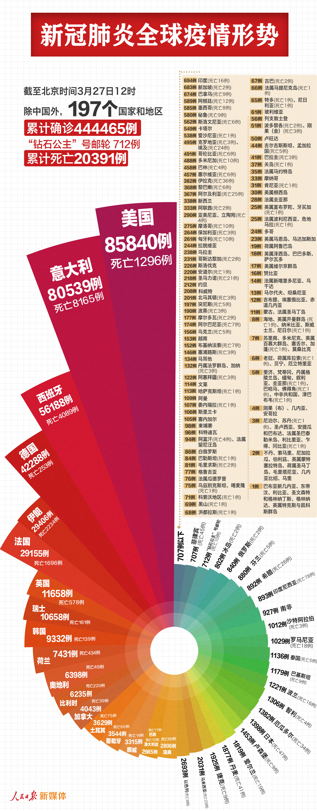
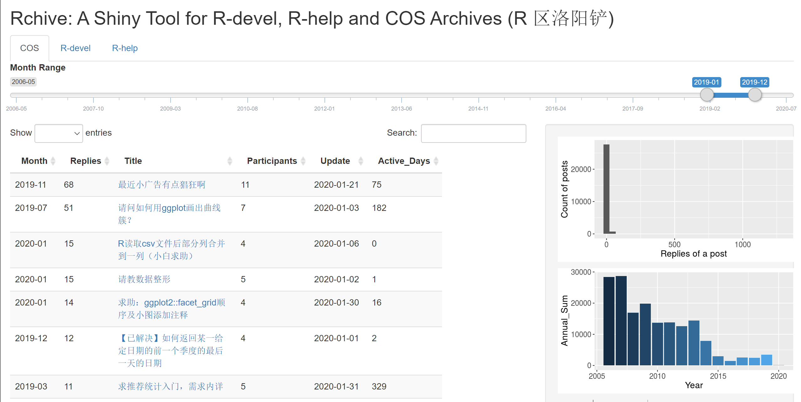
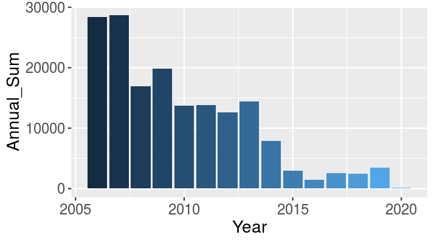
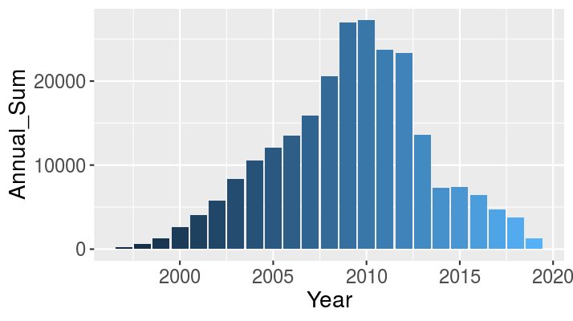
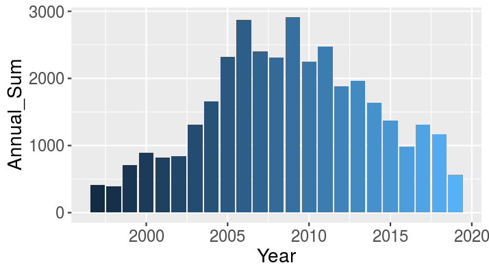

# 现代实例 {#cha:data}

> 　　"哦，你还不知道吧？"他笑了，大声说道。"很惭愧，我写了几篇专论，都是技术方面的。比方说，有一篇叫《论各种烟灰的辨别》。此文列举了一百四十种雪茄烟。卷烟、烟斗烟丝的烟灰，并附有彩色插图，以说明烟灰的区别。这是刑事审判中常常出现的重要证据，有时还是案件的重要线索。举例说，如果你断定某一谋杀案系一个抽印度雪茄的男人所为，显然缩小了侦查范围。在训练有素的人看来，印度雪茄的黑灰与‘鸟眼’牌的白灰的区别，正如白菜和土豆的区别一样大。"
>
> ------柯南 $\cdot$ 道尔《四签名》

本章以一些实际数据案例来说明统计图形的应用，这些数据都尽量取自生活，以保证足够的新颖性；然后，我们利用统计模拟生成的数据来说明统计图形的另类价值，即它在解释统计模型中的独特地位。为了增加阅读的趣味性，我们以探案的形式来介绍统计图形的创建过程，以及应用中可能存在的问题。

首先我们看一个最简单的实例：猪肉价格。

## 猪肉价格

### 案情回放 {-}

最近几年，我们都比较关心物价问题，民间也有不少描述物价上涨的方式，比如笔者曾经在邮件中收到一幅"猪肉价格走势图"（图 \@ref(fig:pork-price-orig)）。

(ref:pork-price-orig) 自 2006 年以来猪肉价格的走势图

```{r pork-price-orig,fig.cap="(ref:pork-price-orig)",echo=FALSE}
knitr::include_graphics(path = "images/pork-price-orig.png", dpi = NA)
```

这幅图非常生动有趣，但莞尔之余我们不妨细看一下这幅图的横坐标------前四根柱子对应的单位是一年，而后面五根柱子的单位却变成了三个月。虽然图中的小猪作腾飞状，但这幅图本身似乎看不出那么夸张的上涨效果，柱状图整体上比较平淡。这是为什么呢？

### 探案过程 {-}

表 \@ref(tab:tab-pork) 列出了图中的数据。这是一个一维时间序列数据。我们按照真实的横坐标单位来重画这幅图，会看到另一番景象。

```{r tab-pork, eval=TRUE, echo=FALSE}
tables$pork = readr::read_csv("tables/pork.csv")
kable2(tables$pork, "2006 到 2011 年猪肉价格", only_head = FALSE, latex_options = "scale_down")
```

对于时间序列，我们通常会采用折线图来表达数据的波动起伏，观察的核心是数据的大小随着时间的变化，但原图使用条形图实际上也有一定道理。这批数据一共只有 9 个数字，如果只是用折线画图，则整幅图形显得单薄，加上该图的装饰物太多，所以更容易埋没数据。相比之下，矩形条的视觉冲击力较强，更能让读者的注意力集中在数据上。本例中，选取折线图或是条形图取决于具体的应用场景。

我们在图 \@ref(fig:pork-price) 中同时给出了两种图形。横坐标被调整到正确的位置之后，2010 年的价格上涨，真的如原图中的小猪一样直飞而上。道理很简单，原本三个月的上涨如果被"稀释"到一年中，那么我们当然不会感觉到强烈的上升趋势。图 \@ref(fig:pork-price) 给我们另外一点启示是，条形图容易观察差异大小（比较条的长短），而折线图更容易观察斜率大小（升降速度）。

(ref:pork-price) R 语言重新绘制的猪肉价格走势图：上方为条形图，下方为折线图，左侧图形的 y 轴从 0 开始，右侧图形的 y 轴从数据的最小值开始

(ref:pork-price-s) R 语言重新绘制的猪肉价格走势图

```{r pork-price,fig.scap="(ref:pork-price-s)",fig.cap="(ref:pork-price)", fig.showtext = FALSE}
msg_graph("pork-price2")
```


当我们用 R 重画出图形的时候，我们意识到纵坐标可能也存在问题：原图的纵坐标的零点对应的价格是多少？可以肯定并不是 0，这一点通过简单地选取参照物就能判断出来，例如 06 和 07 年的差价大约是 6.7，两年价格条高度之差和 2010 年 4 月的价格条高度差不多，这说明零点可能在 8 元/千克左右。这个零点选择似乎非常随意，通常我们画图会以真实的 0 为零点，或者以数据的最小值为零点，很少选取其它位置为零点。关于零点的选取，我们在 \@ref(subsec:data-processing) 小节中会继续解释。这里我们简要说明一下：如果将零点选在真实的 0 上，那么我们更容易计算真实的比率（高度之比）；若选在最小值上，那么更容易看出绝对变化值（因为差异被"放大"了）。

### 探案工具 {-}

本案例使用了条形图（详见 \@ref(sec:barplot) 小节）和折线图（详见 \@ref(sec:plot-default) 小节）。
图 \@ref(fig:pork-price) 可以用 **ggplot2** 包绘制，也可以用 R 基础函数绘制。读者只需用 R 来运行下面的代码即可：

```{r pork-price2, results='asis'}
msg_code("pork-price")
```

```{r, results='asis'}
msg_code("pork-price2")
```

## 中美对比 {#subsec:china-vs-us}

### 案情回放 {-}

2011 年 1 月 19 日，英国《卫报》发表了一篇关于中美国力对比的文章[^guardian]。此时正是中国国家主席胡锦涛访美期间，《卫报》称此次访问是"硬实力与软实力的会晤"。文中分析了中美一些经济社会指标的对比，配图 \@ref(fig:cn-us-guardian)。

[^guardian]: <https://www.theguardian.com/news/datablog/2011/jan/19/china-social-media>

(ref:cn-us-guardian) 2010 年中美国力对比：中国人口多、污染重、GDP 增长快；美国人均 GDP 高、市值高、失业率高

(ref:cn-us-guardian-s) 2010 年中美国力对比扇形图

```{r cn-us-guardian,fig.cap="(ref:cn-us-guardian)",fig.scap="(ref:cn-us-guardian-s)",echo=FALSE,fig.link="https://www.guardian.co.uk/news/datablog/2011/jan/19/china-social-media"}
knitr::include_graphics(path = "images/China-v-US-graphic.jpg")
```

总体来说，这幅图形比较有冲击力，能突出两国各自的优势劣势，尤其值得称道的是作者将各个指标进行了排序，这样便于读者阅读。然而，如果我们再细看一下，就能发现一个问题：由于指标数值都是用扇环表示，因此容易造成一个误会，即数值大小究竟体现在扇环的半径上还是面积上？不同读者的视角自有不同，但这幅图如果按照面积大小去解读数据就错了。该文提供了部分原始数据[^cn-vs-us-source]，见表 \@ref(tab:tab-cn-vs-us)，从中可以看到，中国人口是美国人口的 4.3 倍，但图中中国扇环（红色）的面积显然不止是美国的 4.3 倍，这样可能给读者造成一个印象，似乎中国人口是美国的七八倍。

[^cn-vs-us-source]: <https://docs.google.com/spreadsheets/d/1Fs0B5uCUwt6p7CsjI5CwiZViHspS83pCJ6i-l3OiL7I>


```{r tab-cn-vs-us}
data(cn_vs_us)
cn_vs_us$value[11] = 15
cn_vs_us$value[12] = 3.5
cn_vs_us$value[23] = cn_vs_us$value[23] * 100
cn_vs_us$value[24] = cn_vs_us$value[24] * 10
kable2(cn_vs_us[, 1:4], "《卫报》提供的 2010 年中美国力数据", insert_txt = "。未经订正",  only_head = FALSE)
```

那么，中美国力的实际对比到底是怎样的？我们应该如何用图形恰当地表达其差异？

### 探案过程 {-}


我们利用这些数据重画了《卫报》的图形，如图 \@ref(fig:cn-us-redraw) 所示。

(ref:cn-us-redraw) 重新调整后的 2010 年中美国力对比图：条形图的高度表达数值大小更清楚（图中红色代表中国）。各子图显示的指标详见表 \@ref(tab:tab-cn-vs-us)。注意：本图的“市值”（Market Capitalisation）数据与图 \@ref(fig:cn-us-guardian) 所示的数据中美两国颠倒了，这源于《卫报》给出的数据表中的错误。数据表中还有两处错误，你能找到吗？

(ref:cn-us-redraw-s) 2010 年中美国力对比条形图

```{r cn-us-redraw,fig.cap="(ref:cn-us-redraw)",fig.scap="(ref:cn-us-redraw-s)", fig.width=10, fig.height=6, fig.showtext = FALSE}
msg_graph("cn-us-redraw-tikz")
```


由于我们的主要目的是比较两国的指标，因此简单的条形图足以完成这个任务。我们大致上按中国指标与美国指标的比率大小排列这些条形图。虽然这幅图看上去比《卫报》的图形逊色，但不会造成任何误解，也能更客观反映两国差异。当然，更好的解决方案可能是保持原有的"放射性"设计，但把扇形替换为矩形条。

我们在检查《卫报》提供的数据表时，发现表中"市值"（Market Capitalisation）一栏中美数据颠倒了，对比原图和我们重画的图让我们很快注意到了这个差异。数据的录入错误无处不在，而"看数字不如看图形更直观"这一点也让我们相信图形在检查错误方面有其特殊价值。数据表中还有两处错误，你能通过对比两图找到它们吗？

### 探案工具 {-}

本案例使用了条形图（详见 \@ref(sec:barplot) 小节）和玫瑰图（详见 \@ref(sec:nightingale) 和 \@ref(sec:windrose) 小节），所使用的数据收集在 **MSG** 包中，前文所述的《卫报》数据表中的错误经过了订正。加载数据和绘制图形的代码如下：

```{r, results='asis'}
msg_code("cn-us-redraw")
```


## 新冠疫情 {#sec:covid}

### 案情回放

2020年春节前后，新冠疫情爆发，亿万人的生活和工作都或多或少受到疫情的影响。笔者在关注疫情统计数据的过程中，遇到了一些有意思的问题。这里试举两例。

第一个例子是，笔者看到朋友分享的一幅疫情地图（如图 \@ref(fig:ncov-jiangsu)），显示了 1 月 22 日全国各省确诊和疑似病例，只见沿海和中部地区一片火红（红色表示新冠肺炎确诊病例），唯有江苏省是白色。图上搭配文字：“在吗，救我”，在地图上格外抢眼。笔者即将赴江苏就职，对此格外关注的同时，不免产生疑问：江苏和周边省份差别真的有这么大吗？为什么？

(ref:ncov-jiangsu-s) 新冠疫情下的江苏

(ref:ncov-jiangsu) 新冠疫情下的江苏：2020 年 1 月 22 日，除了江苏省，东部和中部地区一片火红

```{r ncov-jiangsu, out.width="50%", fig.cap="(ref:ncov-jiangsu)", fig.scap="(ref:ncov-jiangsu-s)"}
include_graphics("images/ncov-jiangsu.jpeg")
```

第二个例子是，有一段时间，一种酷似鹦鹉螺的玫瑰图非常流行，如图 \@ref(fig:covid-19) 所示，显示了 2020 年 3 月 27 日除我国以外的世界各国新冠疫情。图中用不同颜色、相同圆心角的扇形来代表确诊 707 例以上的不同国家，各国新冠肺炎的确诊和死亡人数以数字标注。显然，图形经过了精心设计，令人过目不忘。然而，仔细观察却不免心生困惑：与 \@ref(subsec:china-vs-us) 小节所举的例子类似，如果以半径代表数值，那么单从图形看，会给人一种印象，即美国确诊数是德国的 2 倍，而德国大约是英国的 2 倍；但一看数字，德国却大约是英国的 4 倍。那么，确诊数量究竟体现在扇形的哪个属性呢？从图上如何看出各国的实际差异呢？

(ref:covid-19-world) 2020 年 3 月 27 日世界各国新冠疫情的玫瑰图：图中用不同颜色的扇形来代表不同国家

(ref:covid-19-world-s) 世界各国新冠疫情的玫瑰图

```{r covid-19, out.width="60%", fig.cap="(ref:covid-19-world)", fig.scap="(ref:covid-19-world-s)"}

```

### 探案过程 {-}

对于第一个关于疫情地图的问题，笔者获取了当天（1 月 22 日）以及前一天（1 月 21 日）的疫情数据。这是为了避免数据统计时间的不同而出现与图 \@ref(fig:covid-19) 在统计数字上的差异。在这些数据的基础上，笔者绘制了这两天的疫情地图，如图 \@ref(fig:covidchina) 所示。

```{r tab-ncovr}
covid_china = readRDS(system.file("extdata", "covidchina.rds", package = "MSG"))
covid_china2 = covid_china[, 1:3]
names(covid_china2) = c("名称", "01-21", "01-22")
kable2(covid_china2, "全国省级行政区新冠肺炎确诊人数", only_head = FALSE, insert_txt = "（未发现确诊病例的地区并未列出）")
```

在这两张地图上，我们同样是用红色来表示疫情的地理分布；不同的是，我们用红色的深浅来区分确诊病例的多少。同时，由于各省确诊病例数量极差较大，跨三个数量级，我们使用了对数坐标，以便显示低值之间的差异。

从图中可以看出，江苏跟周边省份差别并不是很大：1 月 21 日，除了浙江 5 例确诊（浅红色）外，江苏和安徽无确诊，山东只有 1 例，在地图上都是白色或接近白色；而 1 月 22 日，浙江共 10 例，而江苏、安徽、山东各增加 1 例，均是极浅的浅红色。

(ref:covidchina) 新冠疫情中国地图。图中用红色的深浅来表示确诊病例的多少。由于各省确诊病例数量极差较大，数量跨三个数量级，使用对数坐标来显示低值之间的差异

(ref:covidchina-s) 新冠疫情中国地图

```{r covidchina, fig.show='hold', out.width="49%", fig.cap="(ref:covidchina)", fig.scap="(ref:covidchina-s)", fig.showtext = FALSE}
msg_graph("covidchina")
```

其实，我们可以看到，在图 \@ref(fig:ncov-jiangsu) 中，很多省份其实只有 1 例确诊，却涂上了跟几百例确诊的省份同样的颜色，夸大了江苏和其它省份的差别。当然，笔者作图的角度是比较各省确诊病例的数量级；如果是为了区分“零确诊”与“有确诊”，那就另当别论了。在这个案例里，颜色的选择和图例的重要性可见一斑。

为了直观地看到疫情在地理上的变化，笔者将每天各省的确诊病例做成一张地图，然后连起来做成一幅动画，可以在线观看[^map_animation]。

[^map_animation]: <https://ncov2020.org/animation/map_animation.gif>

对于第二个关于玫瑰图的问题，玫瑰图的本质是条形图，只不过是把条形图的笛卡尔坐标转换成了极坐标：用极坐标的角度代表笛卡尔坐标的 $x$，而半径代表 $y$。从图 \@ref(fig:covid-19) 来看，各国确诊病例对应的肯定不是扇形半径，因为论确诊数量的话，排在第一位的美国是排在末位的菲律宾的一百多倍，而对应的扇形半径凭肉眼判断，肯定相差不到 100 倍。有没有可能是圆心并不代表 0 病例，而是某个其它数值呢？也不是，因为如果那样的话，两者半径相差的倍数只会更多。

会不会是用扇形面积表示确诊数量呢？也不是，因为美国确诊数量是德国的大约两倍，而其扇形面积显然超过这个比例。此外，选用扇形来对比两者大小的时候，要么是令圆心角相同而比较半径的不同（如 \@ref(sec:nightingale) 小节的极坐标面积图和 \@ref(sec:windrose) 小节的风玫瑰图，此时面积与半径的平方成正比），要么是令半径相同而比较圆心角的不同（如 \@ref(sec:pie) 小节的饼图，此时面积与圆心角成正比）。由于人眼对扇形的角度和半径比较敏感，对面积不敏感，一般不会在半径不同的情况下用扇形面积来区分大小。

那么，有没有可能是将确诊数量取了对数之后作图呢？让我们来看一下：以美国、德国和英国为例，美国确诊病例是德国的大约 2 倍，而德国确诊病例是英国的大约 4 倍。假定是以扇形半径来表示确诊病例的对数，那么德英两国的扇形半径差应该是美德两国扇形半径差的 2 倍，但图 \@ref(fig:covid-19) 显然不是这样，甚至相反：德英两国的扇形半径差大约只有美德两国的一半。

为了一探究竟，笔者获取了当天的全球疫情数据，自行绘制了一张类似的玫瑰图，如图 \@ref(fig:covidcountries) 的上图所示，以扇形的半径来表示确诊病例的对数。图中的统计数字略有出入，可能是数据更新的当天时刻有不同，这不影响我们的对比。半透明的环状带标示了病例为 10、100、1000 和 10000 的位置。


(ref:covidcountries) 对数坐标表示的世界各国新冠疫情的玫瑰图（上）和点图（下）：上图用不同颜色的扇形来代表不同国家

(ref:covidcountries-s) 对数坐标表示的世界各国新冠疫情的玫瑰图和点图

```{r covidcountries, fig.width=7, fig.height=8, fig.cap="(ref:covidcountries)", fig.scap="(ref:covidcountries-s)"}
msg_graph("covidcountries")
```

从图中可以看出，玫瑰图用对数来展示确诊病例之后，相邻两个扇形的半径差别就没有那么大了。虽然视觉冲击力小了很多，然而我们可以清晰地从图中看出哪些国家的确诊病例是属于同一个数量级（即处于同一环状带），以及任意两国的病例数对比关系。例如韩国在最外围的半透明带边缘，而俄罗斯位于自外向内第二个半透明带的边缘，即使不看数字，也能知道两者是 10 倍的关系；类似的，美国跟韩国也是大约 10 倍的关系。而图 \@ref(fig:covid-19) 的扇形半径跟确诊病例数有何种换算关系，以及中心的白色半透明圆环表示的是什么意义，我们就不得而知了。

作为对比，笔者将同一组数据做了一张点图，见图 \@ref(fig:covidcountries) 下图。与极坐标相比，在笛卡尔坐标系中，用不均匀的网格来表示对数坐标就会更容易理解。同时，读者可以很直观地从图中获取病例数的大概数值，以便做进一步的比较，这显然比玫瑰图更有意义。例如，前文所述，在对数坐标下，德英两国确诊病例之差应该是美德两国之差的 2 倍，在点状图上一目了然。注意：这张点图里，点的颜色其实是多余的元素；因为点的 $x$ 坐标已经表达了其确诊病例数的数值。笔者在这里仍然标识了颜色，仅仅是为了视觉上的美观而已。

关于笔者参与的有关新冠疫情的进一步研究工作，参见 @zou2020。

### 探案工具 {-}

本案例使用了玫瑰图（详见 \@ref(sec:nightingale) 和 \@ref(sec:windrose) 小节）、点图（详见 \@ref(sec:dotchart) 小节）和地图（详见 \@ref(sec:maps) 小节）。用于绘制图 \@ref(fig:covidchina) 的 R 语言代码为：

```{r, results='asis'}
msg_code("covidchina")
```

这里用到了笔者开发的 R 附加包 **ncovr** [@ncovr] 中的 `plot_ggmap()` 函数。这个函数将中国地图的数据进行了封装，包含了九段线区域（即中国地图右下角的矩形区域）。**ncovr** 包发布在 GitHub 上，安装之前需要先安装 **remotes** 包，再使用其中的 `install_github()` 函数进行远程安装（或者使用 `MSG::msg("0")` 来一次性安装复现本书图形的所有附加包）：

```{r, eval=FALSE, echo=TRUE}
install.packages("remotes")
remotes::install_github("pzhaonet/ncovr")
```


用于绘制图 \@ref(fig:covidcountries) 的代码比较长，除了准备数据的代码外，大部分指令都是用作装饰和细微调整的。例如绘制其中的玫瑰图的核心代码其实只有以下四行：

```{r, eval=FALSE, echo=TRUE}
# 数据映射：
ggplot(covid, aes(country, cum_confirm, fill=cum_confirm)) +
# 条形图：
  geom_col(width=1, color='grey90') +
# 对数坐标：
  scale_y_log10() +
# 极坐标：
  coord_polar()
```

\noindent 其它代码用来添加参考线和文字、修改主题和配色方案、隐藏图例等。完整代码如下：

```{r, results='asis'}
msg_code("covidcountries")
```

## 末日狂奔 {#subsec:canabalt}

### 案情回放 {-}

“末日狂奔”（Canabalt）是一款速度躲避游戏，操控很简单：点击屏幕控制主角跳起，控制好跳跃力度尽量避开一路上的障碍，不要掉下楼，看最后能跑多远。这款游戏的简单与刺激吸引了很多玩家。此外，游戏中还有一定的随机成分，玩家无法预测下一步的场景是什么。

我们关心的重点当然是得分：这款游戏怎么样玩才能得高分？游戏得分和平台是否有关？高分玩家手里的游戏主角会因为什么原因死亡呢？

(ref:canabalt-screenshot) “末日狂奔”游戏截图：楼顶左侧的小人为游戏主角，任务为尽力向前跑，一路上可能遇到很多障碍和意外；右上角为奔跑的距离（483 米）

(ref:canabalt-screenshot-s) “末日狂奔”游戏截图

```{r canabalt-screenshot,echo=FALSE,fig.scap="(ref:canabalt-screenshot-s)",fig.cap="(ref:canabalt-screenshot)"}
knitr::include_graphics(path = "images/canabalt-screenshot.png", dpi = NA)
```

### 探案过程 {-}

由于游戏结束时画面上会提示是否把奔跑的距离发到 Twitter 上，所以 Twitter 上有不少关于这个游戏的得分记录，我们可以抓取这些记录来看各位玩家跑了多远以及玩游戏的平台信息。我们搜集了 1208 条这样的数据，数据包括 3 列：得分、死因和游戏平台（iPad、iPhone 和 iPod touch），如表 \@ref(tab:tab-canabalt) 所示。

```{r tab-canabalt}
data(canabalt)
kable2(canabalt, "“末日狂奔”游戏得分记录")
```

这都是基于离散变量的连续变量比较，一个自然而然的选择就是对离散变量的每一分类分别画图。图 \@ref(fig:canabalt-boxplot) 是基于离散变量的不同分类的箱线图。从图中可以看出，iPad 玩家的平均得分较高，这可能是因为 iPad 相比起 iPhone 或者 iPod touch 来说屏幕较大，玩家易于控制，也可能是因为 iPad 携带起来不够方便，不像另外两个平台随时都能打开玩，因此 iPad 玩家玩起来会更集中精力。至于死因，由于作者对这款游戏并不在行，玩了几次，得到的结果都是因为跳得不够高而撞墙坠落摔死，最多能跑几百米，因此不了解其它死因的场景。因为撞墙摔死的玩家中有很多人得分超高，看来这种障碍的难度并不小。注意我们画箱线图时，对死因做了重新排序——按照得分的中位数排序，这样能方便读者阅读这幅图，否则，读者需要额外花费工夫用眼睛对箱线图排序，对读者来说是不必要的阅读负担。按照原始数据的顺序画图尤其是条形图和饼图中常见的问题，其实排序对于制图者只是举手之劳，对读者却能带来很大的方便。

(ref:canabalt-boxplot) “末日狂奔”游戏得分在不同游戏平台以及死因下的比较：iPad 玩家的分数平均较高，得分最高的人最终是因为"错过另一扇窗"而死

(ref:canabalt-boxplot-s) “末日狂奔”游戏得分在不同游戏平台以及死因下的比较

```{r canabalt-boxplot,fig.cap="(ref:canabalt-boxplot)",fig.scap="(ref:canabalt-boxplot-s)", fig.showtext = FALSE}
msg_graph("canabalt-boxplot")
```

### 探案工具 {-}

本案例使用了箱线图（详见 \@ref(sec:boxplot) 小节）。数据集收在了我们的 **MSG** 包里。运行下面的代码，可以加载这个数据集并做出图 \@ref(fig:canabalt-boxplot)：

```{r, results='asis'}
msg_code("canabalt-boxplot")
```

在 `canabalt` 数据的帮助文档中有这批数据的来源以及收集方式，对抓取网络数据感兴趣的读者不妨看看原作者是如何用 Python 等工具获得数据的:

```{r, eval=FALSE, echo=TRUE}
help("canabalt")
```

## 论坛热度 {#sec:rchive}

### 案情回放 {-}

在 R 语言用户社区里，有五个主要的 R 语言邮件列表系统，是 R 用户获取新资讯、相互交流、获取帮助的传统形式。其中，比较常用的是为普通用户提供帮助的 r-help[^r-help]，以及供开发者讨论的 r-devel[^r-devel]。在中文社区，“统计之都”[^cosx]是比较活跃的 R 语言论坛。然而，近年来，传统论坛的活跃度明显下降。我们想看看，这些传统论坛是何时衰落的；而论坛如今的热门话题一般都在聊些什么。

[^r-help]: <https://stat.ethz.ch/mailman/listinfo/r-help>

[^r-devel]: <https://stat.ethz.ch/mailman/listinfo/r-devel>

[^cosx]: <https://d.cosx.org/>

### 探案过程 {-}

我们创建了 Rchive 这个在线应用[^rchive]，中文叫做“R 区洛阳铲”，意思是用来挖掘 R 语言社区历史的工具。

[^rchive]: <https://sciwis.shinyapps.io/rchive/>


(ref:rchive-s) R 区洛阳铲

(ref:rchive) R 区洛阳铲：一个查询 R 语言邮件列表和论坛的在线应用


```{r rchive, fig.cap="(ref:rchive)", fig.cap="(ref:rchive-s)"}

```

Rchive 的界面如图 \@ref(fig:rchive) 所示。这个网页分 COS（统计之都论坛）、R-devel、R-help 三个标签，点击每个标签就可以进入对应的统计图表界面。每个界面都是分三部分：

- 顶部是一个滑动栏，用户可以选择想要观察的时间段。
- 左栏是数据表，会根据顶端滑动栏选择的时间段筛选出相应的论坛帖子数据，包括发帖年月、回应帖量、帖子标题、参与人数、最近回帖年月和活跃时间。用户可以点击数据表各列顶部的列名称来重新排序，也可以输入关键字筛选。
- 右栏是作图区，显示了给定时间段内的回帖数量的直方图、发帖数量的年际和月际变化图、以及发帖的活跃时间图。

(ref:rchive-ts-s) R 语言论坛热度的年际变化

(ref:rchive-ts) R 语言论坛热度的年际变化

(ref:rchive-ts-a) 统计之都论坛

(ref:rchive-ts-b) R-help 邮件列表

(ref:rchive-ts-c) R-devel 邮件列表

```{r rchive-ts, out.width="32%", fig.subcap=c("(ref:rchive-ts-a)", "(ref:rchive-ts-b)", "(ref:rchive-ts-c)"), fig.cap="(ref:rchive-ts)", fig.scap="(ref:rchive-ts-s)", fig.show='hold'}



```


图 \@ref(fig:rchive-ts) 给出了三个论坛每年发帖总数的变化。从 1997 年创办开始，R-help 和 R-devel 的发帖量基本呈逐年上升的势态，其中 R-devel 在 2005 到 2011 年出现一个高的平台期，每年发帖超过 2000；而 R-help 在 2008 年发帖突破 20000，同样持续到 2011 年。之后，两个邮件列表的热度大体呈逐年下降趋势。相比之下，统计之都论坛在创办之后即进入 2005 年到 2006 年的巅峰，之后在 2007 到 2013 年之间维持一段平台期，每年发帖 14000 左右，此后便逐年下降。笔者对此没有做深入研究，仅仅是猜想，这可能跟社交媒体的兴起以及更多获取帮助方式的出现有关。

R-help 邮件列表里的热门话题涉及 R 包的安装、文本操作、R 包开发等；R-devel 的话题比较高精尖，在这里略过；统计之都论坛 2019 年的热门话题，包含了书稿的群体创作、社区应用的开发、R 语言作图、R Markdown 的中文支持等，十分具有中国特色。

### 探案工具 {-}

Rchive 是使用 R 语言的 shiny 包制作的，主要使用了直方图（详见 \@ref(sec:hist) 小节）、玫瑰图（详见 \@ref(sec:nightingale) 和 \@ref(sec:windrose) 小节）和交互时间序列图。这个工具制作的过程和部分源代码可以参看统计之都论坛的讨论[^rchive-source]。

[^rchive-source]: <https://d.cosx.org/d/420739>

## 绝望主妇 {#subsec:tvearn}

### 案情回放 {-}

2010 年 8 月 11 日，*TV Guide* 杂志公布了一批收入最高的电视剧演员名单，数据中包括演员名称、电视剧名称、类别（正剧 Drama 或喜剧 Comedy）、平均每集的收入，随后有人继续整理了 72 名演员的性别、IMDB （环球电影数据库）评分等信息（表 \@ref(tab:tab-tvearn)）。数据中包括《绝望的主妇》中的 4 位，《好汉两个半》中的 3 位，等等。最高薪酬为每集 125 万美元——该演员为《好汉两个半》中的 Charlie Sheen。《绝望的主妇》中的 4 位演员（Marcia Cross、Teri Hatcher、Felicity Huffman、Eva Longoria）的薪酬为 40 万美元，排在并列第 3。

```{r tab-tvearn}
data(tvearn)
tvearn2 = tvearn[order(tvearn$pay, decreasing = TRUE), 1:4]
row.names(tvearn2) <- NULL
kable2(tvearn2, "电视剧演员薪酬")
```


对于这样一批数据，我们关心的核心对象当然是薪酬：除了简单排序之外，它与其它变量的关系是怎样的？正剧和喜剧是否有差异？评分和薪酬是否有关系？男女演员的薪酬是否有高低之分呢？

### 探案过程 {-}

这批数据收录在 **MSG** 包的 `tvearn` 中。我们可以用数值的方式回答这些问题，也可以作图。如男女演员的平均薪酬，可以使用 R 语言这样计算：

```{r tvearn-mean, echo=TRUE}
data(tvearn, package = "MSG")
# 平均薪酬 pay.mean 以及男女演员数量 pay.number
myfun = function(x) {
 c(mean = mean(x), number = length(x))
}
aggregate(pay ~ gender, data = tvearn, FUN = myfun)
```

\noindent 可以看出女演员平均薪酬比男演员略高。

图 \@ref(fig:tvearn) 上图为男女演员各自薪酬的直方图，可以看出直方图呈右偏趋势，这是由少数演员的薪酬极高造成的；下图为 IMDB 评分与薪酬的关系，我们将电视剧类别用不同颜色标注出来，发现不同类别之间的电视剧薪酬随着评分的变化关系并不相同。图中曲线为 LOWESS 曲线（\@ref(subsec:lowess) 小节）。对正剧而言， IMDB 评分与演员薪酬似乎没有关系，曲线几乎为一条水平线；对喜剧而言，这个关系并非直线关系，评分在 7.9 附近的薪酬最高，此前的薪酬随着评分上升而增加，此后的薪酬则大多回落到 20 万美元以下并再次呈上升趋势。

为了理解这些现象背后的原因，我们有必要研究一下 IMDB 的评分机制。据笔者的初步了解，IMDB 网站并非简单将用户的打分平均，而是综合考虑诸多用户背景信息而加权得到的评分。为何评分高的喜剧不如评分低的喜剧中的演员薪酬高？是制片公司的问题还是 IMDB 评分的问题？笔者并非美剧迷，对这个问题的探索就到此为止，感兴趣的读者可以继续利用数据中的其它变量进一步分析。

(ref:tvearn) 最高收入的男女演员的薪酬直方图（上）：薪酬呈右偏，女演员平均薪酬略高。IMDB 评分与薪酬的关系非线性

(ref:tvearn-s) 演员的薪酬直方图及薪酬与电视剧评分的散点图

```{r tvearn,fig.cap="(ref:tvearn)",fig.scap="(ref:tvearn-s)",fig.subcap=c("",""),fig.ncol=1, out.width="90%", fig.height=10, dev='tikz', fig.showtext = FALSE}
msg_graph("tvearn")
```

当我们对两组直方图进行比较时（实际上是比较两个分布），我们应该如何排列这两幅直方图？图 \@ref(fig:tvearn) 中的直方图为上下排列，原因是这样可以很方便比较分布的各个特征，如最小值、最大值、众数、中位数等；如果我们将直方图左右排列，那么这些比较都将变得困难，因为此时眼睛仅仅上下移动是不够的，我们必须先分别看左右横轴的数字，记住数字之后再在脑中对比数字大小。另外，当我们在画散点图的时候，如果能加上某些平滑曲线或回归直线，那么图中的趋势也将变得更加明显，因为谁都无法用眼睛做回归模型或局部平滑。仅凭眼睛去看，容易被各个孤立的点分散注意力。

### 探案工具 {-}

本案例使用了直方图（详见 \@ref(sec:hist) 小节）和散点图（详见 \@ref(sec:plot-default) 小节），图示可以用下面的代码绘制：

```{r, results='asis'}
msg_code("tvearn")
```


## 音乐之声 {#subsec:music}

### 案情回放 {-}

@Cook07 使用了一个关于音乐曲目的数据，包含了一些曲目的前 40 秒的音频统计量，曲目有古典音乐如莫扎特和维瓦尔第的作品，也有摇滚乐如 Abba 和 Eels 乐队的曲目，而曲目的属性数据包含了曲目类型（古典或摇滚）、左声道频率的均值、最大值和方差等（表 \@ref(tab:tab-music)）。


```{r tab-music}
data(music)
kable2(music[, 1:5], "音乐曲目数据")
```

我们知道，古典乐和摇滚乐给人带来听觉和精神上极大不同的感受。然而，这毕竟是主观感受。它们在音频变量上是否有差异呢？

### 探案过程 {-}

由于这里的变量个数是 3，所以我们可以考虑三维散点图，并用不同颜色标注曲目类型。在真正使用曲目类型这个变量之前，我们不妨对数据做一个简单的探索：试想如果我们并不知道曲目的分类，我们是否能从某些图中看出数据有聚类现象？考虑到古典乐和摇滚乐的区别以及艺术家风格的不同，这种聚类现象应该是很自然的。对于三个连续变量，我们的选择余地并不大：\@ref(sec:andrews-curve) 小节介绍的调和曲线图可以作为探索聚类的工具。

(ref:music-andrews) 音乐曲目左声道频率的调和曲线图：左图中曲线是否有"拧成股"的现象？右图是否是你真实感受到的聚类？

(ref:music-andrews-s) 音乐曲目左声道频率的调和曲线图

```{r music-andrews,fig.scap="(ref:music-andrews-s)",fig.cap="(ref:music-andrews)",fig.width=6,fig.height=2.8,dev='tikz',fig.process=to_png,fig.showtext=FALSE}
msg_graph("music-andrews-tikz")
```

图 \@ref(fig:music-andrews) 为三个变量的调和曲线图。为了不把预期中的聚类现象强加于我们脑中，首先我们不使用任何方式标注分类信息，统一用黑色，如左图所示，这些曲线的走势是否有扎堆现象？这里我们不想故意引导读者，请读者自行观察。某种程度上，标记和不标记分类变量会对一幅图形产生很大的影响，比如即使一幅图中本来没有聚类现象，但由于我们使用了颜色或其它手段将图形元素分了组，这时我们的眼睛很容易引导我们认为图中存在聚类。看完左图之后再看右图，你的结论有变化吗？右图中虚线表示摇滚乐，实线表示古典乐；红色为 Eels，黑色为 Abba，蓝色为维瓦尔第，绿色为莫扎特。从"事后诸葛亮"的角度来说，这些曲目似乎确实存在差异。

调和曲线图展示的并非原始数据，所以即使我们知道有差异，也无法知道差异具体是什么样的。图 \@ref(fig:music-3d-pcp) 上图为三维散点图，用颜色区分了古典乐和摇滚乐；下图为三个变量的平行坐标图。三维散点图往往被人们视为很能吸引眼球的图形，但笔者倾向于反对使用它，原因是多数情况下我们看到的三维图形都是静态的，不可旋转，而三维图形的外观非常依赖于我们观察它的视角，正所谓"横看成岭侧成峰，远近高低各不同"，这给读图带来了视觉上的限制。此外，三维图形也需要空间想象力，例如我们是否能看清图中每个点在纵轴上的高度？观察三维图形中的数值需要用眼睛对三个垂直的平面做投影，这是一件非常费力的工作。这里顺便提一下，Excel 中可以画三维条形图/柱形图甚至饼图，这些图形通常都是非常糟糕的选择。@Krause09 是一篇关于三维条形图的短小评论，感兴趣的读者不妨一读。

(ref:music-3d-pcp) 音乐曲目左声道频率的三维散点图（上）与平行坐标图（下）：三维散点图中我们难以感知点的位置，平行坐标图则更易读

(ref:music-3d-pcp-s) 音乐曲目左声道频率的三维散点图与平行坐标图

```{r music-3d-pcp,fig.cap="(ref:music-3d-pcp)",fig.scap="(ref:music-3d-pcp-s)",message=FALSE,fig.subcap=c("",""),fig.ncol=1,fig.width=4.8,fig.height=2.8, out.width="70%", dev='tikz', fig.showtext = FALSE}
msg_graph("music-3d-pcp")
```

尽管三维散点图有种种劣势，但在本例中有一点可以肯定，那就是古典乐和摇滚乐在频率上是有差异的，因为我们可以看到图中的散点并没有混杂在一起，而是有着较好的分隔（请再考虑一下这是否是"事后诸葛亮"的结论）。为了看清具体的数值上的差异，我们可以使用平行坐标图如 \@ref(fig:music-3d-pcp) 下图。古典乐左声道的频率均值相对较高，但最大值相对较低，而且方差非常小，这说明古典乐的演奏频率相对固定在较高的水平上；而摇滚乐的平均频率相对较低，但最大值和方差都很大，这说明摇滚乐的频率波动幅度较大，高方差也可能是因为最大值太大引起的，这似乎让我们不由联想到嘶吼的摇滚歌手。读者若有兴趣，可以用 R 语言的 **tuneR** 包 [@tuneR] 读入信乐团的《离歌》做分析，看是否能看到"低均值高方差"的特征。

### 探案工具 {-}

本案例使用了调和曲线图（详见 \@ref(sec:andrews-curve) 小节）、三维散点图（详见 \@ref(sec:rgl) 小节）和平行坐标图（详见 \@ref(sec:parcoords) 小节），数据也收录在 **MSG** 包中。以下代码可以加载数据和做出图 \@ref(fig:music-andrews) 与图 \@ref(fig:music-3d-pcp)：

```{r, results='asis'}
msg_code("music-andrews")
```

```{r, results='asis'}
msg_code("music-3d-pcp")
```

## 灌篮高手

### 案情回放 {-}

2009 年 12 月 25 日，CLE 骑士与 LAL 湖人在洛杉矶 Staples Center 展开一场圣诞大战，最终骑士以 102:87 胜出。我们可以从网上[^basketballgeek] 获得这一场比赛的详细数据，甚至包括每一次投篮时球员在球场上的坐标（表 \@ref(tab:CLELAL09-data)）。同时，我们还得到了这场比赛的助攻矩阵数据（表 \@ref(tab:assists-data)）。


```{r CLELAL09-data}
data(CLELAL09, package = "animation")
 # 前 10 行数据
kable2(CLELAL09, "一场篮球比赛的球员坐标")
```

```{r assists-data}
data(assists, package = "MSG")
kable2(assists[,1:6], "一场篮球比赛的助攻数据", latex_options = "scale_down", coln = ncol(assists))
```

作为一名准球迷，笔者想知道，从这批数据中，我们能看出这场比赛有什么特点？投篮结果与投篮位置有什么关系吗？

[^basketballgeek]: <http://www.basketballgeek.com>

### 探案过程 {-}

(ref:assists-sna) 骑士与湖人比赛的助攻网络图：詹姆斯曾为 5 位队友助攻，而奥尼尔不为任何人助攻

(ref:assists-sna-s) 骑士与湖人比赛的助攻网络图

```{r assists-sna,fig.cap="(ref:assists-sna)",fig.scap=" (ref:assists-sna-s)",message=FALSE, dev='tikz', fig.showtext = FALSE}
msg_graph("assists-sna")
```

我们将表 \@ref(tab:assists-data) 的数据绘制成了助攻网络图（图 \@ref(fig:assists-sna)）。其中，West 为 Varejao、Hickson 和 James 各助攻 1 次，James 为 Parker 和 West 各助攻一次。数据中一共有 22 位球员，因此完整数据矩阵维数为 $22\times22$。网络图能让我们很快看出比赛中的助攻关系，图中两个"聚类"显然分别是骑士和湖人的队员。总体来看，骑士队内部助攻次数较多，助攻网比较大，但也有些特立独行的球员如"大鲨鱼"奥尼尔（中锋），他在这场比赛里没有为任何人助攻。湖人队依然是以科比为中心，这一点想必没有读者会觉得惊讶。据说因为莫 $\cdot$ 威廉姆斯在雄鹿队的时候不爱给易建联传球，所以中国球迷给他取名"莫不传"，实际上这场比赛中他也是有助攻的。

骑士队最终赢了湖人，也许是因为这次的协作比较好，不过这都是事后分析。我们可以再看看正常比赛中所有投篮的地点如图 \@ref(fig:CLEvsLAL09)。这里我们需要解释一下，NBA 比赛场地尺寸为 $94\times50$ 英尺，而数据中的 `realx` 和 `realy` 变量是转换过的坐标：假设左半场为骑士（向右半场进攻），右半场为湖人（向左半场进攻），那么 `realx` 和 `realy` 分别指的是球员位置离左侧底线和下边边线的距离（单位为英尺）。简单推理可知，对于骑士来说，`realx` 一定大于 47，湖人则小于 47，例如上面数据中湖人队的加索尔（Gasol）在第 1 节于坐标 $(14,31)$ 处投篮命中。图 \@ref(fig:CLEvsLAL09) 是我们用 R 语言绘制的一幅球场示意图，读者可以对照理解这里的坐标，甚至可以找出图中代表加索尔的点。

显然，这是一幅平滑散点图（见 \@ref(sec:smoothScatter) 小节），颜色越深的区域说明在该地点进行的投篮尝试最多。毫无疑问，几乎所有的篮球比赛都有一个共同特点，那就是大多数投篮都是在篮筐下进行的。湖人进攻时的投篮地点分布相对比较均匀，而骑士的进攻地点则似乎有两处"空白区域"，这很容易让我们考虑，投篮地点和进球结果之间有什么关系？


(ref:CLEvsLAL09) 投篮坐标与结果的平滑散点图：绝大多数投篮的位置都在篮筐下，湖人投篮次数多但命中率低

(ref:CLEvsLAL09-s) 投篮坐标与结果的平滑散点图

```{r CLEvsLAL09,results='hide',fig.cap="(ref:CLEvsLAL09)",fig.scap="(ref:CLEvsLAL09-s)",message=FALSE, dev='tikz', fig.showtext = FALSE}
msg_graph("basketball")
```

笔者对篮球纯属外行，这里提出的问题也许很愚蠢，不过我们还是对地点进行了左右划分，看从篮筐左侧和右侧投篮和是否进球有没有关系，也许有些球员在篮筐某一侧的进球率较高。首先我们去掉在中轴线上的数据（即 realy 不是 25 的数据），然后看左右侧和是否进球的列联表，并作出相应的四瓣图（见 \@ref(sec:fourfoldplot) 小节），如图 \@ref(fig:basketball-fourfold)。

(ref:basketball-fourfold) 球场左右侧投篮命中的四瓣图：两队从球场两侧投篮命中率是否有差别？

(ref:basketball-fourfold-s) 球场左右侧投篮命中的四瓣图

```{r basketball-fourfold,fig.cap="(ref:basketball-fourfold)",fig.scap="(ref:basketball-fourfold-s)", dev='tikz', fig.showtext = FALSE}
msg_graph("basketball-fourfold")
```

骑士在左侧投篮 21 次，进球 7 个；右侧投篮 22 次，进球 11 个；湖人的数据可类似解读。图中扇形环都有重叠区域，所以无论是骑士还是湖人，在篮筐左右侧投篮和结果之间并没有显著关联。仅从数字上看，两队都在右侧进球的几率更高（右上角的扇形半径更长）。

### 探案工具 {-}

本案例使用了网络图、平滑散点图（详见 \@ref(sec:smoothScatter) 小节）、四瓣图（详见 \@ref(sec:fourfoldplot) 小节），用到的坐标数据收录在 **animation** 包里，而助攻数据收录在 **MSG** 包里。下面的代码可以依次绘制本案例的图示：

```{r, results='asis'}
msg_code("assists-sna")
```

```{r, results='asis'}
msg_code("basketball")
```

```{r, results='asis'}
msg_code("basketball-fourfold")
```

本例的数据比前面的例子都大，所以不适合把每一条数据的细节都展示出来，我们需要想办法尽量展示数据的某种概要信息。篮球场的平滑散点图实际上是用 R 语言的低层作图函数和三角函数按照尺寸一点一点勾画出来，在上面叠上一层平滑散点图，让这幅图既能紧扣故事主题，又能展示数据中的信息。**sna** 包中的 `gplot()` 函数可以基于给定的相互关系矩阵很方便作出网络图，而助攻网络图让我们一眼就能看清球员之间的助攻关系，每个人的贡献都在网络图中显示了出来。四瓣图是对列联表的一种代替，它同时显示了列联表数据和相应的统计推断，避免只是基于数据草率得出结论。

在 **animation** 包中，有一个动画展示了这场比赛按时间顺序的所有投篮信息（队员、位置、结果和时间等），代码如下。专业球迷可以去前面提到的网站下载数据进一步分析。

```{r, eval=FALSE, echo=TRUE}
demo("CLEvsLAL", package = "animation")
```

## 神奇数字 {#subsec:percentage}

### 案情回放 {-}

这个案例的背景是一则名为"神奇 87.53 这个数字竟然走红"的新闻报导[^funny-nr]。这则新闻的导火索是"国家统计局称，在他们随机调查的 100 位网友中，有 87.53% 的网友支持封杀 BTchina"，其中百分比 87.53% 引起了网友们的注意。只调查了 100 名，那么小数点后面的 "53" 有何含义？进而有人继续收集了各大网站中的百分比数据[^percentage-web]，试图说明一些统计数字的荒谬。这组百分比数据究竟有何规律？其中有何荒谬之处呢？

[^funny-nr]: <https://news.sina.com.cn/c/2009-12-12/034016758777s.shtml>

[^percentage-web]: 原网页 <http://chemhack.com/cn/2009/12/87-53-stat/> 已失效，快照：<https://web.archive.org/web/20120115032226/http://chemhack.com/cn/2009/12/87-53-stat/>

### 探案过程 {-}

我们也对这件事情关注了一段时间，并得到了一批通过 Google 搜索中国政府网站（域名后缀为 gov.cn 的网站）而得到的从 0.00 到 99.99 的百分比数据，如表 \@ref(tab:gov-cn-pct-data)。


```{r gov-cn-pct-data}
data(gov.cn.pct, package = "MSG")
# 如 0.01% 在所有网站中出现的频数是 171000 次
# kable(head(gov.cn.pct, 5), "latex", booktabs = TRUE, 
#       caption = "中国政府网站中的百分比数据（部分）", align = "c")

kable2(gov.cn.pct, "中国政府网站中的百分比数据", insert_txt = "。round0 和 round1 分别表示是否四舍五入到个位和十分位")
```

我们对这组数据进行了粗略的探索。图 \@ref(fig:gov-cn-pct) 展示了这些百分比数据的搜索频数。其中，左上图用垂线表示了每个百分比的搜索频数大小。从中我们可以发现，垂线在某些区间上显得异常得高。为了更清楚查看这些大频数的位置，我们可以把图形放大，如右上图所示，显示了 $[10\%,\,11\%]$ 区间上的频数。这里我们可以清楚看到取整的百分比的频数明显比其它百分比的频数大，其它区间上有类似的特征。我们绘制了一个 GIF 动画[^gif]，展示了所有长度为 1 的区间上的频数，使这个特征更容易观察到。

为了进一步验证"取整"的猜测，我们可以分别将取整和不取整的百分比以不同样式的点表示出来，并且加上 LOWESS 曲线（见 \@ref(subsec:lowess) 小节）。从图中可以看到，无论是取整到整数还是取整到 1 位小数，搜索频数都明显更高。注意左下图和右下图的 y 轴是取过对数的，因此取整和不取整的实际差异比图中看到的更大。

[^gif]: <https://yihui.org/cn/2009/12/statistics-in-their-eyes/>

(ref:gov-cn-pct) 中国政府网站中的百分比数据 LOWESS 图：首先我们画出每个百分比数据的频数（左上），然后放大 $[10\%,\,11\%]$ 区间上的频数图（右上），继而猜测数据有四舍五入的特征，所以分别对整数位和非整数位的百分比画 LOWESS 曲线（左下），最后分别对保留一位和两位小数的百分比画 LOWESS 曲线（右下）

(ref:gov-cn-pct-s) 中国政府网站中的百分比数据 LOWESS 图

```{r gov-cn-pct,fig.cap="(ref:gov-cn-pct)",fig.scap="(ref:gov-cn-pct-s)",results='hide',fig.keep="first"}
msg_graph("gov-cn-pct2")
```

### 探案工具 {-}

本案例使用了散点图（详见 \@ref(sec:plot-default) 小节）。这里，我们提供了 R 基础作图和 ggplot2 作图两种方法，来绘制图 \@ref(fig:gov-cn-pct)：

```{r, results='asis'}
msg_code("gov-cn-pct")
```

```{r, results='asis'}
msg_code("gov-cn-pct2")
```

类似的建模前的探索性分析还可以在 @Cook07 中找到（小费数据的分析）。这种分析结果很难用数值的方式从数学模型中得到，因此在统计模型应用中，若能事先辅之以统计图形之类的探索，则可能会发现意想不到的信息。

下面，我们继续以一例数据讨论二元变量关系探索中 LOWESS 曲线相比起线性回归模型的重要地位。

## 化点为线 {#subsec:lowess}

### 案情回放 {-}

@Xie08LOWESS 提供了一个植物物种数目与海拔高度的数据，数据中记录了每个海拔高度上的某地植物物种数量，见表 \@ref(tab:tab-PlantCounts)。


```{r tab-PlantCounts}
data(PlantCounts, package = "MSG")
kable2(PlantCounts, "植物物种数目与海拔高度")
```

如果仅仅从回归直线来看，似乎是海拔越高，则物种数目越多。但如此推断下去，必然得到荒谬的结论（地势不可能无限高）。那么，多高海拔处的物种数最多呢？

### 探案过程 {-}

我们知道，线性模型只是非线性模型的特例，尤其对于二元变量，我们不应仅仅以线性模型的简便性而直接假设线性关系。

局部加权回归散点平滑法（Locally Weighted Scatterplot Smoother，LOWESS）提供了一种非常方便的探索二元变量之间关系的图示方法 [@Cleveland79]。LOWESS 主要思想是取一定比例的局部数据，在这部分子集中拟合多项式回归曲线，这样我们便可以观察到数据在局部展现出来的规律和趋势；而通常的回归分析往往是根据全体数据建模，这样可以描述整体趋势，但现实生活中规律不总是（或者很少是）教科书上告诉我们的一条直线。我们将局部范围从左往右依次推进，最终一条连续的曲线就被计算出来了。显然，曲线的光滑程度与我们选取数据比例有关：比例越少，拟合越不光滑（因为过于看重局部性质），反之越光滑（捕捉全局性质）。普通的线性回归可以看作 LOWESS 的特例：数据选取范围为全部数据，局部回归模型用一阶线性回归。

(ref:PlantCounts) 海拔高度与物种数目的 LOWESS 曲线：左图为范围参数从 1% 到 100% 的 LOWESS 曲线（深色表示范围参数小），右图为 200 次 Bootstrap 重抽样之后的数据分别建立的 LOWESS 曲线

(ref:PlantCounts-s) 海拔高度与物种数目的 LOWESS 曲线

```{r PlantCounts,fig.width=7,fig.height=3.5,fig.cap="(ref:PlantCounts)",fig.scap="(ref:PlantCounts-s)", dev='tikz', fig.showtext = FALSE}
msg_graph("PlantCounts2")
```

图 \@ref(fig:PlantCounts) 用 LOWESS 曲线对这批数据进行了初步探索。左图中，曲线颜色越浅表示所取数据比例越大。不难看出，中部浅色的曲线几乎已呈直线状，而深色的线则波动较大。总体看来，图中大致有四处海拔上的物种数目偏离回归直线较严重：450 米（偏低）、550 米（偏高）、650 米（偏高）和 700 米（偏低）附近。若研究者的问题是"多高海拔处的物种数最多"，那么答案应该是在 650 米附近。从图中的曲线族来看，物种数目在过了 650 米高度之后有下降趋势，所以从这批数据来看，我们的结论将是物种数目在 650 米海拔处达到最大值。

图 \@ref(fig:PlantCounts) 右图发挥统计计算的优势，从重抽样的角度对左图的规律作了进一步验证：我们对数据进行重抽样（在 600 行数据中有放回地抽取 300 行），并对重抽样数据画 LOWESS 曲线，为了得到比较稳定的规律，我们将这个过程重复 200 次，得到右图中的 200 条曲线，此处 LOWESS 的范围参数为默认的 2/3。从 Bootstrap 之后的 LOWESS 曲线族来看，在海拔 700 米处的预测可能会有很大的波动，因为这一族曲线在低海拔的位置吻合较好，但在高海拔位置"分歧"比较严重，这进一步说明了我们不能简单以直线外推的方式来预测高海拔的物种数目走向。

至此我们看到了 LOWESS 方法的灵活性，但遗憾的是在国内大多数涉及回归模型的图形中，我们却极少看到它的使用。本例没有任何数学推导（尽管 LOWESS 方法有一定的数学背景），但两个变量的所有可能关系都可以在图中的曲线中显示出来，而且 LOWESS 方法可以看作是一种非参数方法，不涉及统计分布的假设，这和基于参数理论的回归相比也具备一定的优势。

### 探案工具 {-}

本案例使用了散点图（详见 \@ref(sec:plot-default) 小节），数据加载和图形绘制代码如下：

```{r, results='asis'}
msg_code("PlantCounts")
```

```{r, results='asis'}
msg_code("PlantCounts2")
```

## 统计词话 {#subsec:cluster}

### 案情回放 {-}

每一位作者都有自己独特的风格，比如句子段落的长短、用词用语的习惯性等。在文学界，利用统计方法研究作者的文风，并对作品、作者进行分类、判别早就有了非常成功的案例，比如 @li1987 在考证《红楼梦》前八十回和后四十回的作者归属问题时，统计了 120 章回中 47 个常用虚词的频率差异，并以此为据分析得到了很多有意思的结论，解决了几百年来悬而未决的作者疑案，令红学界学者们非常叹服。

词是我国文化艺术的瑰宝。词都短小精悍且多意象，有些词语或词组经常出现，即高频词。那么，高频词与作者风格和意象情感有什么联系呢？

### 探案过程 {-}

我们选取了我国历史上 16 位词人的 3395 篇词，词人是：李煜、苏轼、辛弃疾、黄庭坚、欧阳修、秦观、姜夔、李清照、柳永、晏几道、晏殊、周邦彦、马钰、丘处机、谭处端、王处一；其中最后四位是我国宋末元初的道家（全真教）名人，也是金庸的小说《射雕英雄传》中"全真七子"中的四位，其他 12 位都是词宗级别人物。

首先，我们使用了 @Qiu11 的方法，统计出了词中的高频词汇，并根据高频词分析 16 位作者的作词风格：先统计出每位作者的前 20 高频词，然后将这些高频词（去重复后共 218 个）作为指标，计算出每位作者的词中出现这 218 个双字词的频数矩阵，该矩阵共 16 列 218 行，见表 \@ref(tab:SongWords-data)。


```{r SongWords-data}
load(system.file("extdata", "SongWords.rda", package = "MSG"))
kable2(SongWords[, 1:8], "宋词词频矩阵", coln = ncol(SongWords))
```

我们对这些高频词可能并不陌生。例如，苏轼常用的词中有"人间"（出现过 23 次），我们会自然想到"起舞弄清影，何似在人间"。根据这个矩阵计算 16 位作者的词风相关系数矩阵，以这个相关系数矩阵度量作者之间的相似性，我们就可以对这 16 位作者进行聚类如图 \@ref(fig:song-words-hclust)。这样的图形称为"谱系图"，它很形象地解释了聚类的过程。

下面我们先结合图 \@ref(fig:song-words-hclust) 来介绍层次聚类的基本原理。

聚类的数据基础是距离矩阵；个体与个体能够聚为一类，本质原因是它们之间的距离相近，这里的距离通常采用欧氏距离，即点 $\mathbf{x}_{i}=(x_{i1},x_{i2},\ldots,x_{ip})$ 与点 $\mathbf{x}_{j}=(x_{j1},x_{j2},\ldots,x_{jp})$ 之间的距离为：

$$d_{ij}=\sqrt{(x_{i1}-x_{j1})^{2}+\cdots+(x_{ip}-x_{jp})^{2}}$$

除了个体与个体之间的距离之外，我们还需要定义个体与类、以及类与类之间的距离，这些定义又有多种方式，例如定义一个点与一类点之间的距离为这个点与该类中离它最近的点之间的距离（或最远的点，或类的中心，等等）。定义好这些距离之后，我们就可以开始层次聚类了：首先将所有个体视为单独的类（即：若个体数量为 $n$ 那么此时就有 $n$ 类），然后将最近的两类归到同一类中，接着重新计算一下 $n-1$ 类之间的距离并将最近的两类归为一类，如此操作下去，最终所有的个体都将归入同一类。

(ref:song-words-hclust) 宋词作者层次聚类谱系图：从下到上，16 位作者逐渐"合并"，最终聚为 1 类。作者在纵轴上的位置高低标明了他们进入类的先后顺序

(ref:song-words-hclust-s) 宋词作者层次聚类谱系图

```{r song-words-hclust, fig.cap="(ref:song-words-hclust)",fig.scap="(ref:song-words-hclust-s)"}
msg_graph("song-words-hclust")
```

图 \@ref(fig:song-words-hclust) 背后的距离矩阵是 “$1-\text{相关系数矩阵}$”，意即：若两位词人之间的相关系数为 1 （完全正相关），那么他们的距离为 $1-1=0$；若相关系数 $-1$（完全负相关），那么他们之间的距离为 $1-(-1)=2$。我们知道，相关系数取值在 $-1$ 到 1 之间。所以，这里的距离矩阵确实能体现作者之间的"距离"------距离越大，则相关系数越低。图中我们可以看到，所有作者中，马钰和谭处端最先聚为一类，这是因为他们之间的距离最小；接下来，苏轼和黄庭坚聚为一类，他们的距离次之；后面不断有新的作者聚为一类，如晏几道和欧阳修；也有一些作者直接加入现有的类，如王处一加入马钰和谭处端。我们可以根据这幅谱系图将作者划分为任意数量的类，只需在图的纵轴上以一条横线将这棵倒挂的"树"切割为"树枝"即可（读者若愿意，将它想象成吊着的葡萄枝也未尝不可）。图 \@ref(fig:song-words-hclust) 中的红色矩形框是将作者分为 4 类的结果，我们也可以将他们分为 2 类（结果将是道家作者和其他作者）或者更多类。

实际上，我们也可以直接画出相关系数矩阵。图 \@ref(fig:song-words-corr) 就是对宋词作者相关系数矩阵可视化的一种结果。由于这里我们使用了同样的聚类方法，因此这幅图中得到的最终结果和图 \@ref(fig:song-words-hclust) 是一样的。

(ref:song-words-corr) 宋词作者词风相关矩阵图：主对角线上是对应作者的名字，圆圈大小、颜色深浅和相关系数的绝对值正相关，蓝色、红色分别表示系数的正负，如图右侧颜色图例所示

(ref:song-words-corr-s) 宋词作者词风相关矩阵图

```{r song-words-corr,fig.cap="(ref:song-words-corr)",fig.scap="(ref:song-words-corr-s)",message=FALSE}
msg_graph("song-words-corr")
```

观察图 \@ref(fig:song-words-corr) 可以一目了然地看到词人之间风格的相似程度。词人被划分为四类，如图中方框所示。可以看出，全真四子的词风非常接近，和其他词人风格差别较大； 而全真四子中，只有丘处机和苏轼、辛弃疾、黄庭坚等人的词呈正相关，而其他三子和另外 12 位作者相关系数都为负数。金庸武侠小说中写到，丘处机侠骨热肠，多行走江湖，而他的师兄弟们则执着于道；从这里词风分析来看，亦有相似的结果。李煜、晏殊、姜夔、辛弃疾、黄庭坚、苏轼、秦观、周邦彦、欧阳修、晏几道属于第二类，该类中李煜和其他作者的关系系数较小，其他九位之间的相关系数都较大，尤其是辛弃疾、黄庭坚、苏轼之间，苏辛都是豪放派词人的代表，而黄庭坚是苏轼的第一弟子。第三类只包含了李清照一人，她和其他 15 位词人的关系都很弱，从图中看她是最为独特的词人。 实际上，李清照词的与众不同是广为人知的。她的名作《词论》中，就对很多词人进行了评价：

> 　　李煜语虽甚奇，所谓"亡国之音哀以思"也。柳永词虽协音律，而词语尘下。张子野、宋子京兄弟、沈唐、元绛、晁次之辈，虽时时有妙语，而破碎何足名家！晏殊、欧阳修、苏轼学际天人，然皆句读不茸之诗尔，且常不协音律。王安石、曾巩，文章似西汉，若作一小歌词，则人必绝倒，不可读也。词别是一家，至晏几道、贺铸、秦观、黄庭坚出，始能知之。然晏苦无铺叙；贺苦少重典；秦即专主情致，而少故实；黄即尚故实而多疵病。

最后一类是柳永。晏殊和欧阳修、晏几道（晏殊之子）的词风相关系数也较大。晏殊是欧阳修仕途中的伯乐，他们的词风也较为接近，后人曾一并评价他们"晏元献，欧阳文忠公，风流蕴藉，一时莫及，而温润秀洁，亦无其比"。这和我们从图中得到的信息是完全一致的。

图 \@ref(fig:song-words-corr) 中最重要的信息就是作者两两之间的相关系数，这些信息是不变的；而词人的聚类信息可以随着聚类方法的不同而变动，这些信息是变动的。这对那些所属类群不太明显的作者尤其敏感。 因此，对聚类结果的分析应该慎重而不能绝对化。

从以上的可视分析结果可以看出，结合统计分析和可视化，我们可以在浩如烟海的卷帙中迅速挖掘并展示出很多有用的信息，这在信息爆炸的时代无疑很有应用价值。

接下来，我们分析一下高频词之间的关系。

很多高频词都是词作中常用的意象，分析它们之间的联系，可以得到词的特点以及情感、意象的联系。这里，我们只分析 16 位作者中前 100 高频词的相互联系。

首先定义两高频词的关系系数 $R$：

$$R_{i,j}=\frac{\mbox{同时出现高频词}i\mbox{和}{j}\mbox{的词的数目}}{\mbox{出现高频词}i\mbox{或}j\mbox{的词的数目}}$$ 
显然，当高频词 $i$ 和 $j$ 总是同时出现时，关系系数为 1；当它们从来不同时出现在同一首词时，关系系数为 0。据此可以得到一个 $100\times100$ 的矩阵，并画出这 100 个词的关系网络图，如图 \@ref(fig:song-high-freq)。

(ref:song-high-freq) 宋词前 100 高频词的关系网络图：节点越多的类中圆圈颜色越深，节点间连线的粗细颜色对应不同的关系系数，如“逍遥”和“自在”之间的连线最粗

(ref:song-high-freq-s) 宋词前 100 高频词的关系网络图

```{r song-high-freq,fig.cap="(ref:song-high-freq)",fig.scap="(ref:song-high-freq-s)"}
msg_graph("song-high-freq")
```

观察图 \@ref(fig:song-high-freq)，可以发现，这一百个高频词被划分为多个类。有些类包含多个节点，是个大家族；而有些类仅有一个节点。将包含两个节点以上的类整理如下：

-   第一类（22 个节点，图左下） 自然、 逍遥、 物外、 无为、 蓬莱、 修行、 清净、 山侗、 长生、 功成、 云水、 自在、 马风、 神仙、 水云、 风仙、 自有、 日月、 赴蓬、 功行、 虎龙 、些儿
-   第二类（9 个节点，图右侧） 人间、 风流、 无人、 归来、 江南、 万里、 千古、 当年、 寂寞
-   第三类（8 个节点，图右上） 归去、 落花、 风雨、 如今、 芳草、 不见、 人不、 夜来
-   第四类（7 个节点，图右下） 尊前、 万事、 白发、 相逢、 人生、 青山、 几时
-   第五类（5 个节点，图正上） 千里、 多少、 回首、 月明、 昨夜
-   第六类（5 个节点，图左侧） 今日、 去年、 时时、 日日、 从今
-   第七类（4 个节点，图正下） 春风、 多情、 无情、 杨柳
-   第八类（3 个节点，图正上） 东风、 风吹、 无限
-   第九类（3 个节点，图正上） 相思、 梅花、 花开
-   第十类（2 个节点，图左上） 明月、 清风

第一类颇具清修悟道之味。经查证，全真四子的大多数词都是这个主题和路数，反反复复出现这些字眼，因此这些词之间形成了一个大类。其它几类也都有各自的特色，比如第二类寂寥，第三类凄凉，第四类沧桑，第五类哀思，第六类时间，第七类怀春等等。当然，各个类 都具有自己独特的拓扑结构，同一个类内节点的关系也是不一样的。

高频词之间的关系强弱在图中用不同颜色、粗细的线条表示。比如，“逍遥”和“自在”关系系数最大，超过了 0.3；“清静”和“无为”次之，在 0.2 和 0.3 之间；“清风”和“明月”、“自然”和“清静”、“自然”和“无为”、“逍遥”和“云水”、“逍遥”和“物外”的关系系数也较大，在 0.1 和 0.2 之间。这相比关系系数的中位数（0.007874） 、平均数（0.010280）、上四分位数（0.015380）来说已经非常大了。

从图 \@ref(fig:song-high-freq) 中可以清楚地看出高频词之间的联系。对词感兴趣的读者肯定可以挖掘到更多有意思的信息。需要说明的是，由于本节中的分词手法的局限性，出现了一些意外的高频词，比如"赴蓬"和"人不"，它们本来应该是"赴蓬莱"、"人不寐"、"人不见"等三字词语中的一部分。 对于双字词来说，这些都是噪音，但对整体分析的影响并不大。

本节主要以词频为依据，对词风关系、高频词关系进行了可视分析。图形主要用了相关矩阵图和关系网络图两种，它们都是展示关系的典型方法，可以广泛适用于各种领域中多变量的关系研究，比如蛋白质相互作用网络、社交圈子网络、动植物生存关系网络等。矩阵图和网络图在展示关系数据时各有所长。网络图更直观易懂，但仅局限于较为稀疏的关系矩阵；当关系矩阵比较稠密时，连线太多，会导致图形杂乱无章（图 \@ref(fig:song-high-freq) 中，我们仅选取了大于 0.05 的关系系数，且进行了离散化处理；而图 \@ref(fig:song-words-corr) 则是完全展示）。相关矩阵图对关系矩阵是否稀疏不敏感，并且可以更精准地表达更多形式的关系系数（比如带正负的、更多水平的）， 但它没有网络图直观，且在变量较多时占地面积较大。

两种方法的共同特点是都以具体统计、数学模型为基础来探求相关关系，且这些关系发掘算法有很多是可以互通的。可视分析是数据分析和图形展示的有机结合。显然，前期的数据分析是最终图形的基础，比如本节中系统聚类的应用以及词风、高频词关系系数的定义等都是极其重要的。在实践中，我们应该根据具体问题和需求选择恰当的数据分析方法和最终的可视化方式。

### 探案工具 {-}

在 R 中我们可以用函数 `hclust()` 来实现层次聚类，需要提供的是距离矩阵和类与类之间的距离定义：

```{r hclust-usage, results='asis'}
usage2(usage(hclust, output = FALSE))
```

本案例使用了层次聚类谱系图、相关矩阵图和关系网络图，数据加载和图形绘制的代码如下：

```{r, results='asis'}
msg_code("song-words-hclust")
```

```{r, results='asis'}
msg_code("song-words-corr")
```

```{r, results='asis'}
msg_code("song-high-freq")
```

需要说明的是，这里仅仅用设定阈值的粗糙方法来划分高词频的类。**igraph** 包中提供了很多算法对网络进行聚类，比如 fastgreedy、walktrap、spinglass 等方法，读者可以自行尝试。此外，除了图 \@ref(fig:song-words-corr)，**corrplot** 包还支持以其它方式来展示相关矩阵，读者不妨一试。

## 统计模拟

统计模型中常出现一些抽象概念。我们可以通过图形和模拟将这些抽象的概念具体化，用事实说话，使得模型的意义直观可见，本节以回归中的一些概念和问题为例，说明图形和模拟对模型意义的解释。这里没有用到任何实际数据，所有数据都是通过设计、模拟而来，用到的图形主要是散点图和它的变种。

### 线性回归

回归模型是绝大多数统计模型的基础，而一元回归又是回归的基础。一般教学中常从一元回归引入基本思想，在讲完大量的一元回归性质之后再开始多元回归。这种顺序的优点在于它由浅入深，使初学者容易入门，但同时也会带来一些误区。多元回归与一元回归的显著不同在于：首先，它通过控制其它自变量来检查一个自变量与因变量的关系，而这里的"控制"可能会对初学者造成理解上的困难；其次，多元回归引入了"交互作用"的概念，也是一元回归中不存在的。为了使初学者走出用一元回归的视角去看待多元回归的常见误区，我们可以通过模拟和图形的方式给出两个非常直观的例子。

首先考虑"控制变量"：一元回归下我们通常用散点图观察自变量和因变量的关系，并将回归模型解释为 $X$ 变化导致 $Y$ 如何变化，多元回归则需要考虑其它自变量的水平，在其它自变量保持不变的条件下，看我们关心的自变量和因变量的关系。模拟的场景设计为：因变量 $y$ 与自变量 $x$ 在控制了第二个自变量 $z$ 之后为负相关关系，但不控制 $z$ 的时候为正相关关系。真实模型如下：

$$y=-x+z+\epsilon$$

\noindent 其中 $x$ 在 $[0,4]$ 区间上取值，$z=0,1,\cdots,4$，$\epsilon\sim N(0,\sigma^{2})$，$\sigma=0.25$。这个模拟的关键在于让 $z$ 的增长胜过 $x$，这样看似 $y$ 随着 $x$ 的增大而增大，实际上控制 $z$ 的水平之后 $y$ 与 $x$ 是负向关系。以下是一个示例：


```{r multireg-lm, echo=TRUE}
set.seed(123)
x = seq(0, 4, length = 100)
z = rep(0:4, each = 20)
y = -x + z + rnorm(100, 0, .25)
# 回归系数全都显著
coef(summary(lm(y ~ x)))
coef(summary(lm(y ~ x + z)))
```


显然，若用 $y$ 对 $x$ 直接做一元回归的话，得到的回归系数是非常显著的正数，但若在回归模型中加入 $z$ 变量，$x$ 的系数则变为非常显著的负数！图 \@ref(fig:multireg-scatter) 用散点图进一步揭示了这个问题的本质。左图中，我们可以看到 $x$ 与 $y$ 是正向关系，而右图中我们根据 $z$ 的不同取值将样本点用不同的符号和颜色标示出来，每一种符号（及颜色）代表了一种 $z$ 的取值，可见每一小组数据点中，$y$ 与 $x$ 都是负向关系。所谓多元回归的"控制其它变量"的意义，可以用图 \@ref(fig:multireg-scatter) 清晰表达出来。本例也说明了一元回归和多元回归的本质不同，多元回归系数不能由简单的一元回归得到。

(ref:multireg-scatter) 控制变量 $z$ 之后 $y$ 与 $x$ 的关系：左图看似 $x$ 和 $y$ 正向关系，而右图中控制了 $z$ 取值水平之后 $x$ 和 $y$ 就变成了负向关系

(ref:multireg-scatter-s) 控制变量 $z$ 之后 $y$ 与 $x$ 的关系

```{r multireg-scatter, fig.cap="(ref:multireg-scatter)",fig.scap="(ref:multireg-scatter-s)",fig.width=7,fig.height=3.5,dev='tikz', fig.showtext = FALSE}
msg_graph("multireg-scatter2-tikz")
```

这里给出图 \@ref(fig:multireg-scatter) 的两种作图代码：

```{r, results='asis'}
msg_code("multireg-scatter")
```

```{r, results='asis'}
msg_code("multireg-scatter2")
```

然后我们考虑"交互作用"：交互作用仅存在于模型中有多个变量时的情形，它的含义是一个自变量对因变量的影响系数受另一个自变量的取值水平影响，其基本数学形式为（以二元回归为例）：

$$y=\beta_{0}+\beta_{1}x_{1}+\beta_{2}x_{2}+\beta_{3}x_{1}x_{2}+\epsilon$$

我们将上式稍作改写：

\begin{align}
y &= (\beta_{0}+\beta_{1}x_{1})+(\beta_{2}+\beta_{3}x_{1})x_{2}+\epsilon \\
&\equiv \alpha_{0}+\alpha_{2}x_{2}+\epsilon
\end{align}

若我们将 $x_{1}$ 固定在特定水平，那么 $x_{2}$ 的回归系数为 $\alpha_{2}=\beta_{2}+\beta_{3}x_{1}$，它与 $x_{1}$ 有关；同理，$y$ 与 $x_{1}$ 的关系也受 $x_{2}$ 的不同水平影响。交互作用的含义在传统的统计学教科书中一般都用折线图表示，而折线图只能表示自变量为分类变量时的交互效应，对于连续自变量情况的交互作用图示，我们则很难找到任何示例。

这里我们提出用气泡图的方式来展示连续变量的交互效应。模拟场景如下：

\begin{align}
y &= 2+x+0.5z+0.5xz+\epsilon (\#eq:interaction) \\
y &= 2+x+0.5z+\epsilon (\#eq:nointeraction)
\end{align}

式 \@ref(eq:interaction) 是有交互效应的回归模型，式 \@ref(eq:nointeraction) 不包含交互效应。我们让 $x$ 和 $z$ 都从 1 到 10 取值，然后对于每一组 $x$ 和 $z$ 的组合，计算出 $y$ 值，最终我们将 $x$、$z$ 和 $y$ 用气泡图表示出来如图 \@ref(fig:interaction-bubble)。我们无需用数值的方式去解读交互效应，只需要看图中"气泡"的大小随着 $x$ 和 $z$ 的取值不同如何变化即可。这样一来，交互效应的概念便一目了然。同时本例也是对交互效应的传统展示方法的一种补充。

(ref:interaction-bubble-s) 连续型自变量的交互作用气泡图

(ref:interaction-bubble) 连续型自变量的交互作用气泡图：左图中 $x$ 与 $z$ 有交互效应，右图无交互效应。气泡图中，气泡的大小与真实的 $y$ 值大小成正比，所以如果我们要查看自变量对 $y$ 的影响，只需要看自变量对气泡大小的影响即可。以左图为例：例如分别给定 $x=1$ 和 $x=10$，随着 $z$ 的增大（从下向上看），$y$ 值在增大，但 $x=1$ 和 $x=10$ 处的增大速度明显不一样（后者快），也就是说，$z$ 对 $y$ 的影响大小受 $x$ 的取值水平影响。同理可以看右图，任意给定 $x$ 值，$y$ 随着 $z$ 的增大速度都一样，说明 $x$ 与 $z$ 之间没有交互效应

```{r interaction-bubble,  fig.cap="(ref:interaction-bubble)",fig.scap="(ref:interaction-bubble-s)",dev='tikz',fig.process=to_png,fig.width=7,fig.height=3.5,fig.showtext=FALSE,small.mar=FALSE}
msg_graph("interaction-bubble-tikz")
```

```{r, results='asis'}
msg_code("interaction-bubble")
```

### 稳健回归

统计模拟具有简便易行的优势，只要我们清楚数学理论假设，就可以按照假设条件设置模拟环境，以计算作为推导的一种替代。本小节以 @Venables02 中介绍的最小中位数平方（Least Median Squares，LMS）回归模型为对象，来设计统计模拟并用图形说明这种模型的性质。

最小中位数平方回归（下文简称 LMS 回归）是稳健回归方法中的一种，它对离群点有良好的耐抗性，即：数据中的离群点对 LMS 回归系数的影响非常小。LMS 回归的目标函数是残差平方的中位数，系数估计通过下式得到：

$$\hat{\boldsymbol{\beta}}=\arg\min_{\boldsymbol{\beta}}\text{median}\left\{ (y_{i}-\hat{y}_{i})^{2}\right\} ,\ i=1,2,\cdots,n$$

\noindent 其中 $\hat{y}_{i}=X_{i}\boldsymbol{\beta}$。[@Venables02] 简略介绍了 LMS 回归并提出了它的一个缺点：它对大量集中在数据中心的数据点非常敏感。这一条性质在书中并没有详细介绍，但我们可以很快用模拟的方式来验证它，而不需要真正去进行数学推导。模拟场景如下：

首先生成具有线性关系的自变量 $x$ 和因变量 $y$，然后在各自的均值附近生成大量随机数填充进原数据，最后计算 LMS 回归结果，看原来的线性关系是否能被保持（理论上 $x$ 与 $y$ 的线性关系将受到严重影响）。为了更直观地观察计算结果，我们用散点图加回归直线的方式来表达结果。下面的 R 函数用来生成包含普通最小二乘（OLS）回归直线和 LMS 回归直线的散点图：

```{r OLS-LMS-fun, echo=TRUE}
library(MASS)
gg_olsLms = function(df, lqs_xy){
  lqs = lqs(y ~ x, method = "lqs", data = df)
  df$y1 = predict(lqs)
  ggplot(df, aes(x, y)) +
    geom_point() + 
    geom_smooth(aes(color = "OLS"), method = "lm", se = FALSE) +
    geom_line(aes(x = x, y = y1, color = "LMS")) +
    scale_color_manual(
      name="Model",
      values=c(OLS = "red", LMS = "blue")) +
    theme(legend.background = element_blank(), 
          legend.position = c(0.1, 0.9))
}
```

然后我们按照模型 $y=2+3x+\epsilon$ 生成两批模拟数据，第一批包含一个离群点，用以检验 LMS 回归相比起 OLS 回归的稳健性；第二批数据包含 500 个分布在数据中心附近的随机数，用以检验"LMS 回归对中心数据敏感"的性质：

```{r OLS-LMS-data, echo=TRUE}
set.seed(123)
x = runif (50)
y = 2 + 3 * x + rnorm(50)
# 插入一个离群点 (2, 50)
x1 = c(x, 2)
y1 = c(y, 50)
# 插入 500 个分布在数据中心的随机数
x2 = c(x, jitter(rep(mean(x), 500), 10))
y2 = c(y, jitter(rep(mean(y), 500), 10))
```

(ref:OLS-LMS) LMS 回归的稳健性及其缺点：左图体现了 LMS 回归的稳健性，右图体现了 LMS 回归对中心数据点敏感的特征

(ref:OLS-LMS-s) LMS 回归的稳健性及其缺点

```{r OLS-LMS, fig.width=7,fig.height=3.5,fig.cap="(ref:OLS-LMS)",fig.scap="(ref:OLS-LMS-s)", dev='tikz', fig.showtext = FALSE}
msg_graph("OLS-LMS2-tikz")
```

图 \@ref(fig:OLS-LMS) 中的两幅散点图及其回归直线表明了 LMS 回归对离群点的稳健性和对中心数据的敏感性。左图中 OLS 回归直线的斜率明显被右上角的离群点"拉"大，但 LMS 回归并没有受离群点影响，它的斜率反映了大部分数据所体现的规律；右图中 OLS 回归直线斜率反映了所有数据的趋势，而 LMS 回归的斜率则明显违背了数据的趋势。通过模拟和图形，LMS 回归的优缺点一目了然。


这里给出图 \@ref(fig:outlier-resample) 用 R 基础函数和 **ggplot2** 包的作法：

```{r, results='asis'}
msg_code("OLS-LMS")
```

```{r, results='asis'}
msg_code("OLS-LMS2")
```

### 离群检测

在某些情况下，我们也可以在统计模拟中找到解决问题的新思路，这样能避免严格的数学证明推导，更有效地利用现有的计算机资源为统计模型理论提供发展和创新的可能性。在绝大多数情况下，统计模拟一定能得出结果（无论对错或是否有普遍意义），但数学推导则并不一定，这也是统计模拟的一大优势。下面，我们基于传统的回归离群点诊断方法，通过模拟和图形提出一种新的诊断方法。

我们知道，传统的离群点诊断方法有一个很大的弱点，就是当数据中有多个离群点的时候，传统方法如 Cook 距离等测度可能会失效，因为这些方法都是基于删除一个数据点来看回归模型的变化；多个离群点有可能会在同一个"方向"上，如果只是删除其中一个，剩下的离群点仍然会影响回归模型，从而掩盖掉删除该离群点的效果。对这个问题，笔者的一个直接想法是，我们可以通过重抽样或部分抽样并结合图形可以找出多个离群点。具体来说，我们可以把"删除一个数据点"的想法推广到"删除若干个数据点"，这样一来，就存在多个离群点被同时删掉的可能性了，当出现这种情况时，回归系数理论上会发生很大变化，这种变化既可以用数值指标计算出来，也可以用图形画出来。

以下是模拟场景：生成两个服从标准正态分布的独立随机变量 `x` 和 `y`，长度为 100，理论上它们的回归系数为 0，但是在样本点中加入 2 个距离相近的离群点，然后用 Cook 距离方法诊断，最后用前面的部分抽样思路诊断。以下是模拟的 R 代码：

```{r, results='asis'}
msg_code("outlier-resample2")
```

(ref:outlier-resample) 用部分抽样方法诊断多个离群点：普通线性回归受离群点影响（左上），但传统离群点诊断方法如 Cook 距离并不能诊断出所有离群点（右上），如果我们对数据进行抽样（左下），则可以得到几类回归系数值（右下）

(ref:outlier-resample-s) 用部分抽样方法诊断多个离群点

```{r outlier-resample, fig.cap="(ref:outlier-resample)",fig.scap="(ref:outlier-resample-s)",dev='tikz',fig.process=to_png,fig.width=4,fig.height=4,fig.showtext=FALSE,small.mar=FALSE}
msg_graph("outlier-resample2-tikz")
```

图 \@ref(fig:outlier-resample) 展示了传统诊断方法与这里提出的抽样诊断方法的比较。左上图显示普通线性回归受离群点影响严重：理论上回归直线应该是水平的（斜率为 0），但右上角的两个离群点将回归直线拉起；右上图画出了这个回归模型中每个样本点的 Cook 距离，从图中可以看到，只有最后一条数据是离群点，而事实上倒数第二条数据也是离群点，只是删除这一条数据之后回归模型不会有太大变化（受最后一条数据掩盖），所以它不能被 Cook 距离识别出来；左下图显示了一种抽样的可能性：我们抽取数据的前 60 条（图中用实心点表示），去掉数据的后 42 条（空心点表示），然后重新建立回归模型，并画出回归直线，此时我们可以看到，由于去掉了两个离群点，回归直线的斜率大致为 0，与理论相符了；基于这种抽样的想法，我们将这个步骤重复 100 次，每次重新随机抽取一部分数据（可能包含离群点，也可能不包含），并重新计算回归系数，最终把 100 次的斜率都记录下来并画在右下图中，可以看出，这些斜率大致分为三群，这种"多群"的特征反映出原数据中有不止一个离群点（否则 100 个斜率只会分为两群：包含或不包含一个离群点的结果），靠近 0 的斜率是抽样不包含两个离群点的结果，而靠近 1 的斜率是包含两个离群点的结果，中间一层斜率是包含一个离群点的结果（可能是最后一条数据，也可能是倒数第二条）。这样我们就成功诊断出传统方法找不出来或者找不完全的离群点现象。这个模拟的动画版本可以在线[^multiple-outliers-detection]观看。

[^multiple-outliers-detection]: <https://yihui.org/cn/2008/09/multiple-outliers-detection/>

本例仅仅是以模拟的方法提供了一种离群点诊断新思路，沿着这种想法，我们可以继续发展新的理论，来弥补传统理论的不足。

这里我们给出图 \@ref(fig:outlier-resample) 的 R 基础作图代码和 **ggplot2** 包作图代码：

```{r, results='asis'}
msg_code("outlier-resample")
```

```{r, results='asis'}
msg_code("outlier-resample2")
```

## 思考与练习

1.  对于统计模拟来说，使用静态图形有什么潜在危险或劣势？换言之，动画有什么优势？另一方面，当今的计算机资源如此强大，让模拟变得非常简单，你是否担心模拟数据泛滥成灾？

2.  聚类分析的一个关键问题就是我们无法验证究竟这些所谓的"类"到底是真的存在，还是被视觉误导；\@ref(sec:psychology) 小节也提到了一个 K-Means 聚类的例子。从图形的角度而言，你是否有什么办法移除可能的"伪聚类"现象？例如：设计试验让不同的人群看原始图形和用聚类方法作过标记的图形。
