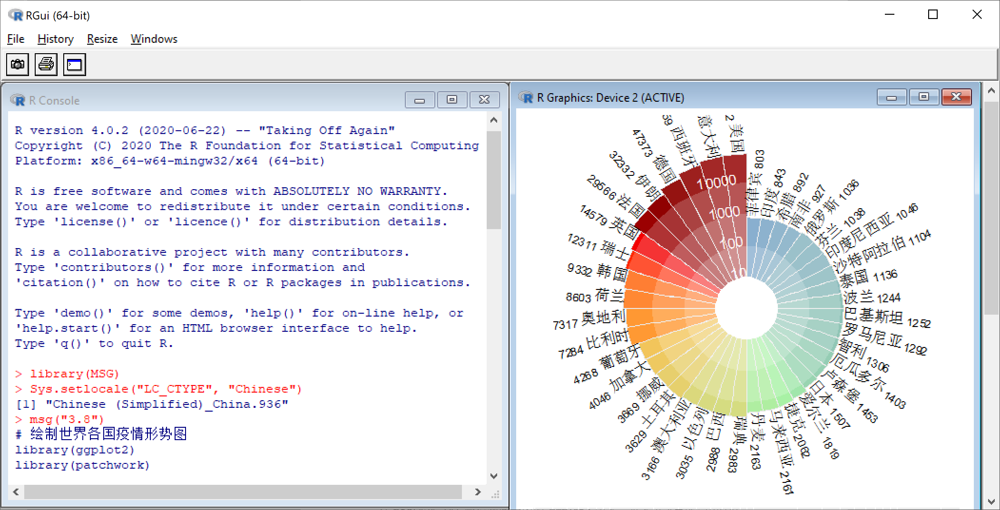

# 作图工具 {#cha:tools}

> 　　"好了，好了，我的好伙计，就这么办吧。我们在这房子里共同生活了好几年，如果再蹲在同一座牢房里就更有意思了。华生，我跟你说实话。我一直有个想法：我要是当罪犯，一定是超一流的。这是我在这方面难得的一次机会。看这儿！"他从抽屉里拿出一个整洁的皮制小袋，打开来亮出里面几件闪亮的工具。"这是最新最好的盗窃工具，镀镍的撬棒，镶着金刚石的玻璃刀，万能钥匙，以及对付现代文明所需要的各种新玩意儿。我这儿还有在黑暗中使用的灯。一切都准备好了。你有走路不出声的鞋吗？"
>
> ——柯南 $\cdot$ 道尔《查尔斯 $\cdot$ 密尔沃顿》

```{r, echo = FALSE}
## 工具简史
```

## 选择准则

传统的作图工具，无非就是笔、尺、纸一类。随着计算机科技的发展，现代的工具和作图软件层出不穷。面对这么多工具，我们应该如何选择呢？我们认为主要的准则有三点：一是统计计算功能齐全，二是统计元素易于控制，三是图形类型丰富多样。

在人们通常的观念中，图形往往代表着简单，然而直观与简单是两个不同的概念。图形的首要作用的确是直观展示信息，而这里的信息未必是简单的。一幅优秀的统计图形背后也许隐藏着重要的统计量，而统计量是统计图形的最关键构成因素。

我们日常见到的所谓统计图形，常常是 Microsoft Excel 的产物。事实上，Excel 的图形总体看来只有三种：第一种是表现绝对数值大小，如条形图、柱形图、折线图等；第二种是表现比例，如饼图；第三种则是表示二维平面上的变量关系，如 X-Y 散点图。从更广泛的意义上来说，Excel 展示的几乎都是原始数据，基于数据的统计推断的意味比较单薄。而统计学的核心研究对象是什么？答案应该是分布（Distribution）。注意：分布不仅包含一元变量的分布，而且更重要的是多元变量的分布，诸如"均值 "、"方差"、"相关"和"概率"等概念都可以归为分布的范畴。无论 Excel 的图形如何搭配色彩、怎样变得立体化，都跳不出上述三种类型的限制，而不能全面妥善表达统计学的要义。可能正是因为这样的原因，统计图形界内的一位大家 Leland Wilkinson 才说，给统计刊物投稿时永远不要用 Excel 作图。相比之下，本书所采用的 R 语言能表达的统计量种类极其丰富。毫不夸张地说，任何理论上可以计算出来的统计量都能在 R 中很方便地以图形的方式表达出来。

除了统计量之外，我们也应对图形本身的组成元素给予足够的重视。这些元素包括点、线（直线、曲线、线段和箭头等）、多边形、文本、图例、颜色等，往往这部分工作都由常见的统计软件替我们做了——我们不必自己设计点、线等基本元素，但同时也就意味着我们几乎无法灵活运用这些元素（比如在图中添加点、线、文本标注等）。表面上看似计算机软件给我们省了不少麻烦，实际上，这种限制的弊端要大于那一点微不足道的好处。我们在实际工作中遇到不少这样的例子，比如往散点图中添加若干条不同的回归直线（根据某自变量不同分类的回归、或者是不同分位数的分位回归 [@quantreg] 直线等）、在图中添加箭头或者文本标注甚至添加包含希腊字母、微积分符号、上下标的数学公式等等，不一而足。对于这些简单问题，用传统的（商业）统计软件恐怕太难解决，原因就在于，它们让计算机替代了太多本可以由用户完成的工作。当然，总体来说，自动化是好事，但如果为了自动化而大幅度牺牲可定制性，则可能得不偿失了。

相比之下，R 语言汇集统计计算与统计图示两种功能于一身，灵活的面向对象（Object-Oriented，OO）的编程方式让我们可以很方便地控制图形输出，从而制作出既精美又专业的统计图形。我们说图形并不意味着简单，指的是统计图形的构造可以很细致入微（包括统计量的选定和图形元素的设计），而不是指 R 作图的过程或程序很复杂。同样，如果我们总是需要在图形细节上耗费大量的精力，那么 R 也将不是一个好工具。在第\@ref(par:gallery)部分和第\@ref(par:systems)部分，我们会介绍若干作图的细节问题，读者需要斟酌美观与效率之间的平衡，避免陷入细节泥潭；实际上，**ggplot2** 是一个可以大幅减少细节设置的图形系统，我们将会在第\@ref(cha:ggplot2)章详细介绍。

要想真正精通统计图形，首先要练好基本功（例如对图形基础元素或构造作深入的了解），然后在此基础上通过各种抽象、提炼和认识，最终上升到理性认识的境界（自如地表达统计量）。

## R 语言简介 {#sec:R-intro}

R [@base] 是一款优秀的统计软件，同时也是一门统计计算与作图的语言，它最初由奥克兰大学统计学系的 Ross Ihaka 和 Robert Gentleman 编写 [@Ihaka96]。自 1997 年起, R 开始由一个核心团队（R Core Team）开发，这个团队的成员大部分来自大学机构（统计及相关院系），
包括牛津大学、华盛顿大学、威斯康星大学、爱荷华大学、奥克兰大学等。除了这些作者之外，R 还拥有一大批贡献者（来自哈佛大学、加州大学洛杉矶分校、麻省理工大学等），他们为 R 编写代码、修正程序缺陷和撰写文档。迄今为止，R 中的程序包（Package）已经是数以万计，各种统计前沿理论方法的相应计算机程序都会在短时间内以软件包的形式得以实现，这种速度是其它统计软件无法比拟的。除此之外，R 还有一个重要的特点，那就是它是免费、开源的。由于 R 背后的强大技术支持力量和它在统计理论及应用上的优势，加上目前国内对 R 的了解相对较少，我们期望能够通过本书引进并推动它在国内的广泛使用。

R 的功能概括起来可以分为两方面：一是统计计算（Statistical Computation），二是统计图示（Graphics）。它由一个语言系统（R 语言）和运行环境构成，后者包括图形、调试器（Debugger）、对某些系统函数的调用和运行脚本文件的能力。R 的设计原型是基于两种已有的语言：S 语言 [@Becker88] 以及 Sussman 的 Scheme，因此它在外观上很像 S，而背后的执行方式和语义是来自 Scheme。R 的核心是一种解释性计算机语言，指令以函数的形式书写和运行，大部分用户可见的函数都是用 R 语言编写的，而用户也可以调用 C、C++ 或者 FORTRAN 程序以提高运算效率。正式发行的 R 版本中默认包括了 **base**（R 基础包）、**stats**（统计函数包）、**graphics**（图形包）、**grDevices**（图形设备包）、**datasets**（数据集包）等基础程序包，其中包含了大量的统计模型函数，如：线性模型/广义线性模型、非线性回归模型、时间序列分析、经典的参数/非参数检验、聚类和光滑方法等，还有大批灵活的作图程序。此外，附加程序包（add-on
packages）中也提供了各式各样的程序用于特殊的统计学方法，但这些附加包都必须先安装到 R 的系统中才能够使用 [@Hornik-FAQ]。

R 的官方网站^[<https://www.R-project.org>]中对 R 有详细介绍，我们也可以从它在世界各地的镜像（CRAN^[<https://CRAN.R-project.org>]，全称 Comprehensive R Archive Network）下载 R 的安装程序和附加包。可能令读者感到不便的一点是，R 不像别的统计软件那样，图形用户界面（GUI，即 Graphical User Interface）提供琳琅满目的菜单。R的界面常常是命令行界面（CLI，即 Command Line Interface），即：输入一些代码，R 就会输出相应的运算结果或其它输出结果。因此，在正式使用 R 之前，我们有必要大致了解一下 R 的运作方式。

计算机科学家 Nikiklaus Wirth 曾经提出，程序语言的经典构成是“数据结构+算法”：数据结构是程序要处理的对象，算法则是程序的灵魂。R 也不例外，它有自己独特的数据结构，这些数据结构尤其适应统计分析的需要，它们包括：向量（vector）、矩阵（matrix）、数据框（data frame）、列表（list）、数组（array）、因子（factor）和时间序列（ts）等。当然，数值、文本和逻辑数据都可以在 R 中灵活使用；至于算法，我们暂时可以不去过多了解，因为 R 中已经包含了大量设计好的函数，对于一般的用户来讲都不必自行设计算法，除非有特殊或者自定义的算法，那么也可以根据 R 的语法规则编写程序代码。

对 R 的运作方式粗略了解之后，我们再回头看看 GUI。一个软件的菜单、按钮、对话框等 GUI 组件不可能无限增多，否则软件会变得无比庞大臃肿，而繁杂的操作顺序的难度将很可能会超过使用程序命令行的难度。而且，非开源的 GUI 隐藏了计算原理，除了程序的原始编写者，无人知道输出结果究竟是以怎样的方式计算出来。随着统计学的发展，各种新方法、模型必将不断涌现，我们现在不妨试想未来的统计软件用户界面将会变成什么样子。看看 R 的发展，可以体会到这种思路：菜单不可能无限增加，但是程序、函数都是可以无限增加的——道理很简单，因为它们不受计算机屏幕的限制。迄今为止，R 的仓库（repository）中附加包的数量已经超过 1.6 万个，这还只是 CRAN 上的仓库，不算另外几个站点如 [Bioconductor](https://www.bioconductor.org/)、 [R-Forge](https://r-forge.r-project.org/) 、 [Omegahat](http://www.omegahat.net/)以及 [GitHub](https://github.com)。在这样的大仓库中，我们可以找到最前沿的统计理论方法的实现，所需做的仅仅就是下载一个附加包，通常只有几十 K 到几百 K。值得注意的是，R 的主安装程序大小只有几十 M。相比之下，SPSS 的安装程序已达六七百 M，而 SAS 的基本安装程序也有数百 M，从程序大小角度便可知 R 语言的精炼。

关于 R 更深入的介绍，请参考官方发行的若干手册和网站上的大量学习材料，如官方的 7 本手册（均可从 R 的安装目录或者官方网站^[<https://cran.r-project.org/manuals.html>]上找到）：

- An Introduction to R (R-intro)
- R Data Import/Export (R-data)
- R Installation and Administration (R-admin)
- Writing R Extensions (R-exts)
- R Internals (R-ints)
- The R Language Definition (R-lang)
- The R Reference Index

\noindent 其中，R-intro 手册附录 A 中给了一个很好的代码入门演示，推荐读者通过这个演示初步熟悉 R 语言；其它手册都比较偏重 R 的底层介绍，不适合对计算机程序没有深入了解的初学者阅读。

近年来，大批 R 语言的中文学习资料面世。早年出版的有 *R for Beginners* [@paradis2002]，已由笔者及其他几位合作者翻译为中文，可从统计之都^[ <https://cosx.org>]获得；几本官方手册由丁国徽翻译为中文，R-intro 的中文翻译文档可以在官方网站下载；*A Beginner’s Guide to R* [@zuur2009] 比较适合初学者，有中译本。新出版的书籍有《学 R：零基础学习 R 语言》一书[@zhao2018]，适合零基础的初学者；*ggplot2: Elegant Graphics for Data Analysis* [@wickham2016]一书专门介绍 R 语言的作图包 **ggplot2**，已由统计之都译为中文[@wickham2016zh]。除了 R 的书籍之外，我们也推荐 R 的初学者和爱好者通过访问“统计之都”网站及其 R 语言版块^[<https://d.cosx.org/t/r>] 共同学习、讨论和研究。

由于 R 是完全开放源代码的，所以我们可以自由修改代码以构建符合自己需要的程序，但是一方面这需要一定的其它程序语言技能（典型的如 C 语言），因为 R 的很多基础函数都是用 C 写的；另一方面，对于绝大多数用户，其实没有必要对基础包进行修改——既然 R 是开源软件，其代码必然受到很多用户监视，这样就会最大程度减少程序错误、优化程序代码，而且我们也可以在 R 里面自定义函数，这些函数可以保存起来，以后同样还能继续使用，或者自行编写 R 包。对比起来，现今的商业统计软件都将源代码和计算过程封闭在用户完全不知道的黑匣子中，而在用户界面上花大量的功夫，这对统计来说，毫无疑问并非长久之计。我们相信，随着读者对 R 的深入了解，一定能体会到这个软件的真正强大之处。

## 重现本书图形

在进入下一章之前，我们建议读者先将 R 安装在自己的计算机上，以便阅读时可以随时使用 R 来绘制本书出现的图形。关于R 的安装和使用方法，请读者查阅前面提到的参考书，本书仅作简要介绍，以满足读者重绘本书插图的需要。简单来说，读者只要完成 R 语言和附加包的安装，那么每次只需加载 **MSG** 包，就可以用一条指令来复现书中插图和查看源代码了。

### 安装 {#sec:installation}

进入 CRAN 官方网站[^cran]或镜像网站（如清华大学镜像^[<https://mirrors.tuna.tsinghua.edu.cn/CRAN/>]）主页，会发现顶端有 Download and Install R 一项，只需根据自己的操作系统选择相应的链接进入下载即可。R 软件可以在多种操作系统上运行，包括 Windows、Linux 以及 MacOS 等。

[^cran]: <https://cran.r-project.org/>]

- Windows 用户应点击 “Download R for Windows”，然后点击 “base”，就可进入基础安装包的下载页面。此时点击 “Download R-\*.\*.\* for Windows”（\*.\*.\* 表示版本号，例如 4.0.2），便可将安装包下载到本地，直接安装。安装过程中会出现一些选项，如无特殊要求，均按默认即可。
- Linux 用户可点击 “Download R for Linux”，然后根据具体的系统如 RedHat、Ubuntu 等选择对应的链接。既可以用现成的二进制包，也可以自行下载源代码编译安装。但要注意：如果从源代码编译，则需要自己解决依赖问题；这些依赖包如果不存在，那么运行 `./configure` 的时候会给出提示。
- Mac 用户可点击“Download R for (Mac) OS X”，然后选择 R-\*.\*.\*.pkg 文件下载安装。

注意：R 语言一直在开发更新中，通常每隔三个月会发布一次新版本，请读者务必注意检查自己的 R 是否为最新版本，这一点尤其 Windows 用户容易忽略。据笔者本人的经验，保持 R 软件跟上最新版本通常利大于弊。

除了安装 R 语言环境之外，R 的附加包需要另行安装。Windows 用户可以点击菜单（Packages $\Rightarrow$ Install Package(s)）安装附加包（附加包都是从镜像上下载的，因此安装时要保证网络连接正常；当然我们也可以先将程序包下载到本地计算机上然后安装）。不过，更普遍的做法是在 R 中使用函数 `install.packages()`。例如，本书配备了一个名为 **MSG** 的附加包，提供一些实例和有用的函数，安装方法是运行下面的代码（启动 R 和输入指令的界面见图 \@ref(fig:r-gui)）:

```{r, eval=FALSE, echo=TRUE}
install.packages("MSG")
```

R 语言有很多附加包可以绘制统计图形。其中，**ggplot2** [@ggplot2]是当前最受欢迎和最为流行的绘图包。本书介绍的大部分统计图形，都配有对应的 **ggplot2** 代码。安装 **ggplot2** 包的方法是：

```{r, eval=FALSE, echo=TRUE}
install.packages("ggplot2")
```

除了 R 自身的 **graphics** 包和 **ggplot2**包，本书当然不可避免会使用 **base** 和 **grDevices** 等基础包中的函数，这些基础包一般不用特别加载，R 在启动的时候会自动加载进来。另外，本书还用其它附加包来介绍特殊的统计数据、统计方法以及模型涉及到的图形，例如分类数据（Categorical Data）会提到 **vcd** 包，生存分析会用到 **survival** 包。当读者第一次使用某个附加包时，需要自行按照上面的示例来安装，这个步骤在本书中不再赘述。

当我们需要调用附加包时，可以使用 `library()` 函数，例如加载 **MSG** 包：

```{r, eval=FALSE, echo=TRUE}
library(MSG)
```

为了方便读者重现本书的插图，读者可以使用 **MSG** 包的 `msg()` 函数，一次性安装本书示例代码中所有需要的附加包：

```{r, eval=FALSE, echo=TRUE}
msg("0")
```

### 使用

安装好 R 之后，Windows 和 Mac 用户可以从程序快捷方式直接启动 R，Linux 用户则可从终端敲入命令 `R` 启动。这里以 Windows 为例，简单介绍一下在 R 中绘制本书插图的方法。

R 在 Windows 中启动后的界面如图 \@ref(fig:r-gui) 所示。我们会看到几行自动出现的信息，大意是：R 是由很多贡献者一起协作编写的免费软件，用户可以在一定许可和条件（GPL）下重新发布它。在红色的 `>` 提示符后面，用户可以输入指令，点击回车就会运行。

(ref:r-gui) R 语言自带的图形界面 RGui

```{r r-gui, fig.cap="(ref:r-gui)"}

```

图中的三行代码含义是：

```{r eval=FALSE, echo=TRUE}
library(MSG) # 加载 MSG 包
Sys.setlocale("LC_CTYPE", "Chinese") # 设置语言环境为中文
msg("3.8") # 运行 msg() 函数，绘制图 3.8
```

\noindent 其中，第二行用来设置语言环境的字符格式为中文。这是由于笔者的操作系统为英文 Windows，R 对字符处理时也会相应采用英文格式，这样对中文字符的识别会出现问题，所以笔者要用这条指令使 R 能正确处理中文字符。如果读者的操作系统本身就是中文，那么这条指令可以忽略。

**MSG**包的 `msg()` 函数专门供读者快速绘制本书中的插图。只要指定插图编号，如 `msg("4.1")`，就可以得到图 4.1（运行 `msg("24.1")`会得到同一图的 **ggplot2** 版本；见本书“导读”中的说明），并在指令运行的结果下面得到绘图的源代码。读者可以拷贝、修改这些代码，体会 R 语言作图的方法。

R 自带的图形界面比较简陋。读者可以另行安装其它的界面或者开发环境，例如目前最为流行的 RStudio 集成开发环境[^rstudio]。

[^rstudio]: <https://rstudio.com/products/rstudio/download/#download>

### 帮助 {#sec:help}

如果我们不知道某个函数的用法，可以查看帮助。R 拥有一套完善而便利的帮助系统，这对于初学者是很好的资源。若已知函数名称，我们可以简单用问号 `?` 来获取该函数的帮助，比如查询`msg()`函数，只需在命令行中敲入：

```{r, eval=FALSE, echo=TRUE}
?msg
```

\noindent 则会弹出一个窗口，显示该函数的详细说明，一般都会包括 Description （描述）、 Usage（用法）、Value（返回值）、Examples（示例）等丰富的信息。其中，Example 给出的示例代码往往最具有实用性：用户只需原样拷贝粘贴到命令行运行，就可以直观查看运行的结果。

大多数情况下，`?` 等价于 `help()` 函数：

```{r, eval=FALSE,echo=TRUE}
help(msg)
```

\noindent 但有少数特殊的函数在查询其帮助时需要在函数名上加引号，比如 `?+` 就查不到加法的帮助信息，而 `?'+'` 或者 `help("+")` 则可顺利查到加法帮助信息，类似的还有 `if`、`for` 等。

更多情况下，我们并不知道函数名称是什么，此时也可以使用搜索功能，即函数 `help.search()`（几乎等价于双问号 `??`）。例如我们想知道方差分析的函数名称，则可输入命令 `help.search("analysis of variance")`，弹出的信息窗口会显示与搜索关键词相关的所有函数，如 `aov()` 等。

知道名称以后，接下来我们就可以通过前面讲到的 "`?`" 来查询具体函数的帮助信息。函数 `help.start()` 可以打开一个网页浏览器用来浏览帮助。

有时，我们还需要查看已经安装的某个附加包的详细信息，例如包的用途、作者、依赖关系等。可以使用 `library()` 函数的 `help` 参数，或者 `help()` 函数的 `pacakge` 参数。下面的代码会查询 **MSG** 包的详细信息：

```{r, eval=FALSE,echo=TRUE}
library(help = "MSG")
help(package = "MSG")
```

本书中使用了很多示例数据，可以用 `data()` 函数加载，详见各章节的示例。如果读者想了解这些数据的更多信息，那么可以使用 `help()` 函数，例如：

```{r, eval=FALSE, echo=TRUE}
help(PlantCounts, package = "MSG")
```

如果这些帮助功能还不够用，例如有时候需要的函数在已经安装的包中找不到，那么最常见的解决方法是在搜索引擎中搜索相应的关键词，或者到爆栈网[^stackoverflow]搜索。此外，官方网站提供了搜索资源列表[^search]，网站上的邮件列表导航（Mailing List Archives）也是很有用的资源，其中有大批统计相关学科的著名教授以及世界各地的统计研究者和 R 爱好者在那里用邮件的方式公开回答各种关于 R 的问题。

[^stackoverflow]: <https://stackoverflow.com/>
[^search]: <https://www.r-project.org/search.html>

我们在此如此强调帮助系统，目的在于告诉读者，要想学好 R 语言，除了阅读相关书籍资料，也应该自己多多动手利用信息资源解决自己的问题。

下面，请读者在 R 中安装和加载 **MSG**包，运行 `msg("2.2")`，让我们以 **ggplot2** 绘制的拿破仑远征图（图 \@ref(fig:ggplot2-minard)），开始统计图形之旅。

```{r, results='asis'}
msg_code("ggplot2-minard")
```


(ref:fig-ggplot2-minard) R 语言的 **ggplot2** 包绘制拿破仑远征图：我们可以对比图 \@ref(fig:minard)

(ref:fig-ggplot2-minard-s) R 语言的 **ggplot2** 包绘制拿破仑远征图

```{r ggplot2-minard, fig.cap='(ref:fig-ggplot2-minard)', fig.scap='(ref:fig-ggplot2-minard-s)', fig.width=4.9, fig.height=2.5, dev='tikz', fig.showtext = FALSE}
msg_graph("ggplot2-minard")
```

## 思考与练习

1. 大多数开源软件都会特别强调说明 ABSOLUTELY NO WARRANTY，这是否让你感到开源软件质量没有保证？CRAN 上的 R 包已经数以万计，而这些用户贡献的附加包几乎都是没有人去检查质量好坏（服务器上只做一些例行检查如是否有语法错误），我们应该以什么样的原则去使用附加包？盲目信任、完全摒弃或者自行测试？

1. 统计图形和统计计算有怎样的联系？
